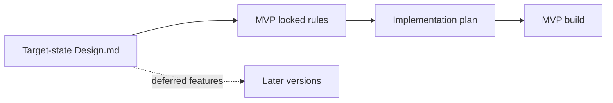
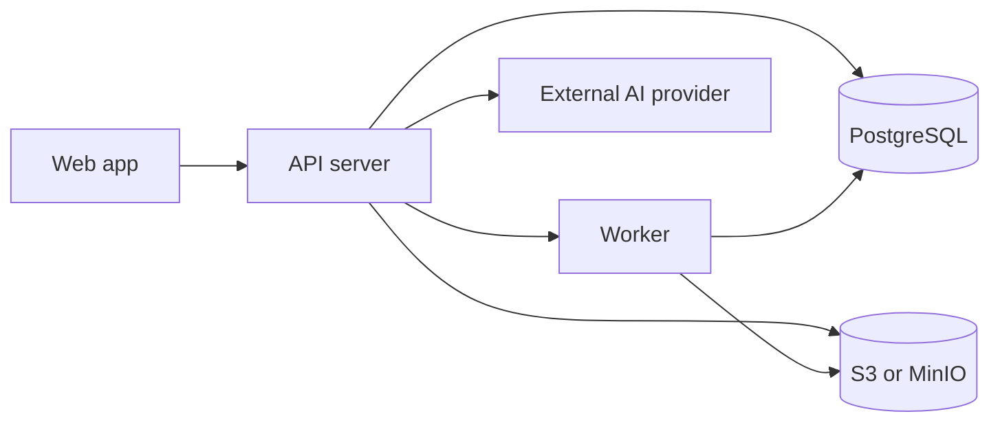
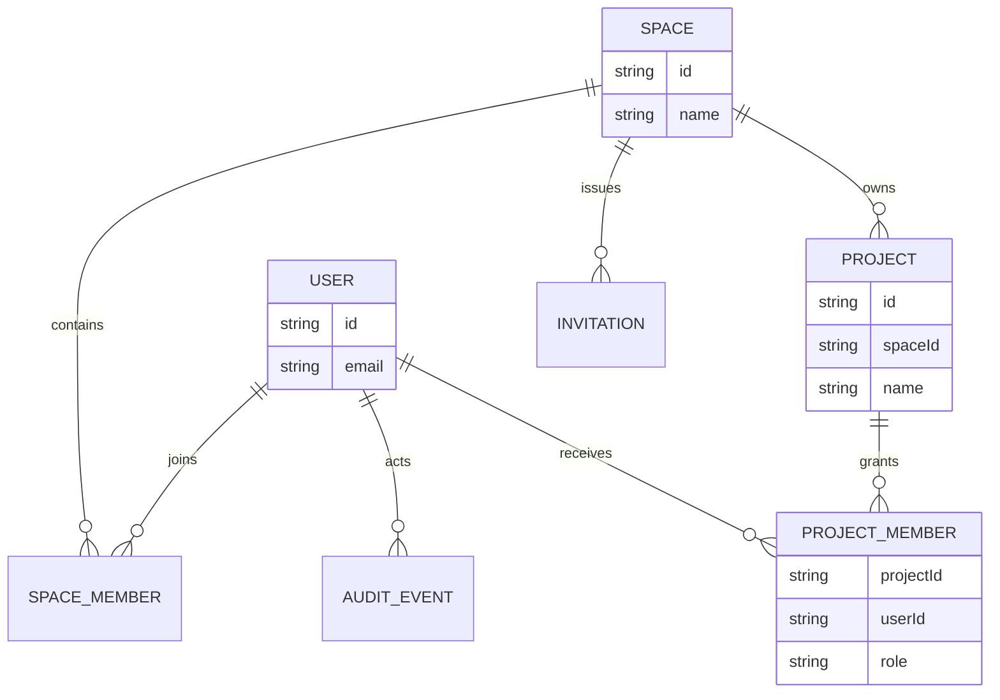
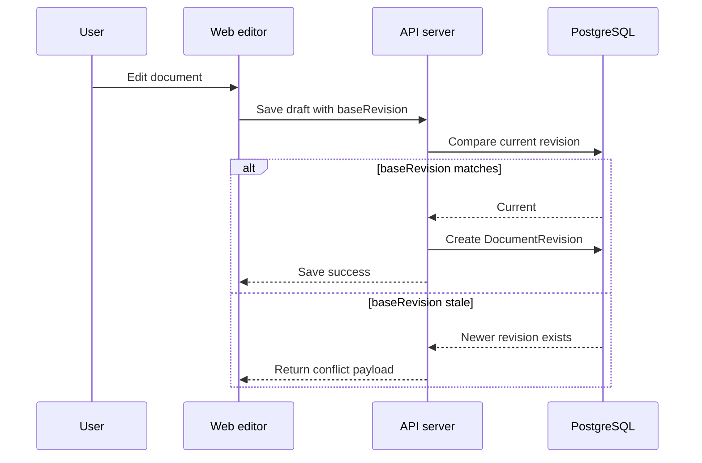
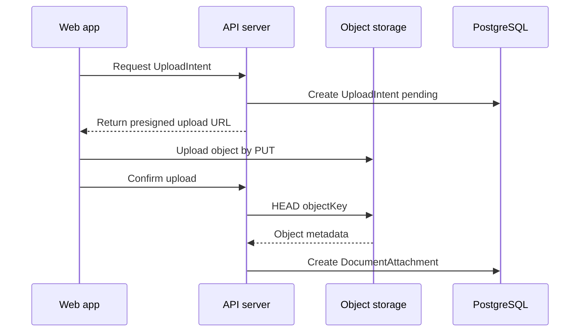

# Jixia MVP 锁定规则

_用途：记录已确认的 Jixia MVP 工程边界、权限规则、文档模型、附件链路与 AI 约束。最后更新：2026-07-17。_

---

## 文档性质

`Design.md` 定义目标态产品方向。本文件定义 MVP 已锁定规则。

若两者冲突，MVP 实现以本文件为准。目标态能力可以保留在 `Design.md` 中，但不自动进入首版工程范围。



## MVP 总边界

MVP 是 Web-only 的实验室研究工作台，不做 Electron、本地文件系统集成、实时多人协作、实验对象、公开分享链接、结构化证据图谱和自动研究流水线。

MVP 优先交付：账号与项目权限、个人 Notebook、项目 Project Docs、统一块编辑器、文档版本、附件、AI 私人对话、个人 AI 配置、基础审计。

MVP 明确移出首版：`Reference`、`Excerpt`、`Citation`、`EvidenceRevision`、`NotebookDocReference`、证据版本固定、文档引用链、知识图谱、数据库块、同步块、embed 块、公式块、公开链接、实时协作、Agent 式自动写入。

```text
[MVP主线] ──┬── 账号权限 ──┬── User / Space
             │              └── ProjectMember
             ├── 文档系统 ──┬── Notebook
             │              └── Project Docs
             ├── 附件系统 ──┬── UploadIntent
             │              └── DocumentAttachment
             └── AI系统 ────┬── AIConversation
                            └── AIProviderConfig
```

## 系统架构

MVP 采用服务器优先架构。



首版推荐组件：Web App、API Server、Worker、PostgreSQL、S3/MinIO。语义搜索若进入首版，用 `pgvector` 起步；需要独立扩展时再评估 Qdrant。

MVP 技术栈锁定为前后端分离方案：`Vite React + Fastify + PostgreSQL + Prisma + S3/MinIO`。

首版优先采用清晰边界的 monorepo：

```text
apps/web       # Vite React 前端
apps/api       # Fastify API server
packages/db    # Prisma schema/client
packages/shared# 前后端共享类型
apps/worker    # 后台任务与清理任务
```

后端 API 使用 Fastify。它是权限和业务规则中心。前端不得自行判断内容访问权、附件访问权、AI 配置可见性或审计边界。Worker 与 API 共享数据库模型，但由独立进程执行过期清理、附件清理和用量聚合。

## 身份、租户与权限

一个部署只服务一个实验室 `Space`。系统保留 `spaceId`，但不做多租户 Space 切换，不做跨 Space 权限。

核心模型：`User`、`Space`、`SpaceMember`、`Project`、`ProjectMember`、`Role`、`Invitation`、`AuditEvent`。

角色首版固定为：`SpaceAdmin`、`ProjectOwner`、`ProjectEditor`、`ProjectViewer`。

`Project` 默认私有。只有 `ProjectMember` 能读项目内容。`SpaceAdmin` 可以管理账号、邀请和项目元数据列表，但不能默认读取、下载、删除研究内容。

所有 `SpaceMember` 都可以创建 `Project`。创建者自动成为该项目的 `ProjectOwner`。`SpaceAdmin` 除了拥有后台治理入口外，在研究协作关系中与普通成员一样；它不会因为 admin 身份自动获得别人项目的内容权限。



账号只允许 `SpaceAdmin` 邀请注册。无开放注册。

`Invitation` 至少包含：`spaceId`、`email`、`role`、`tokenHash`、`expiresAt`、`acceptedAt`、`invitedBy`。只保存 token hash，不保存明文 token。邀请链接有效期为 7 天。

登录态使用 `HttpOnly Secure Cookie + 服务端 Session`。Cookie 只存 `sessionId`，前端不能读取 session token。Cookie 设置为 `HttpOnly`、`Secure`、`SameSite=Lax`。服务端 Session 存 `userId`、`expiresAt`、`revokedAt`。过期策略为 7 天滑动过期。续期只在接近过期窗口触发：当剩余有效期少于 2 天时，服务端把 session 延长到 7 天。

退出登录支持两种操作：当前设备退出只 revoke 当前 `sessionId` 并清除 cookie；全设备退出 revoke 该用户所有未过期、未撤销的 session，并清除当前 cookie。后续请求只要命中 `revokedAt IS NOT NULL` 或 `expiresAt < now`，都视为未登录。

MVP 不提供密码重置流程。不做用户自助“忘记密码”，也不做管理员发送重置链接。账号恢复不进入首版范围，后续版本单独设计。

## Document 模型

MVP 使用统一 `Document` 表，`type` 区分个人笔记和项目文档。

```text
Document
  ├─ id
  ├─ type = notebook | project
  ├─ ownerUserId     # notebook 必填
  ├─ projectId       # project 必填
  ├─ currentRevisionId
  ├─ revisionNumber
  ├─ status = active | archived
  └─ updatedAt

DocumentDraft
  ├─ documentId
  ├─ userId
  ├─ baseRevision
  ├─ draftContent
  └─ updatedAt

DocumentRevision
  ├─ documentId
  ├─ revisionNumber
  ├─ contentSnapshot
  ├─ editorUserId
  └─ createdAt
```

数据库必须强制 `Document.type` 约束：`notebook` 必须有 `ownerUserId` 且 `projectId IS NULL`；`project` 必须有 `projectId` 且 `ownerUserId IS NULL`。

`Notebook` 和 `Project Docs` 共享同一块编辑器、同一草稿机制、同一版本机制。差异只进入权限服务：`notebook` 走 `ownerUserId`；`project` 走 `ProjectMember`。

`DocumentRevision.contentSnapshot` 是块编辑器 JSON，不用 Markdown 做主存储。Markdown 只做导出格式。每个快照必须携带 `editorSchemaVersion`。旧快照读取时迁移到当前结构；恢复旧版本时先迁移，再生成新的 `DocumentRevision`。

`DocumentRevision` 保存完整文档快照。`diff` 不入库，冲突比较、历史查看和恢复差异按需计算。

## 编辑、草稿与冲突

定时 autosave 只更新 `DocumentDraft`。手动保存或离开页面确认保存才创建正式 `DocumentRevision`。

保存时客户端携带 `baseRevision`。服务端检查当前 `revisionNumber`。如果匹配，创建新版本；如果过期，进入冲突处理，不覆盖。

MVP 不做实时多人编辑，不引入 CRDT/Yjs。冲突合并只允许人工处理，AI 不参与冲突解决，也不能自动合并。



## Document 生命周期

`Document.status = archived` 时文档只读。`active` 才允许保存草稿和正式版本。恢复到 `active` 后才能继续编辑。

归档和恢复权限：`notebook` 只能由 `ownerUserId` 操作；`project` 只能由 `ProjectOwner` 操作。`ProjectEditor` 不能归档或恢复项目文档。`SpaceAdmin` 不能绕过项目内容权限。

`notebook` 和 `project` 都允许 hard delete，但必须二次确认。`notebook` hard delete 只能由 owner 执行；`project` hard delete 只能由 `ProjectOwner` 执行。

`Document` hard delete 会删除 `Document`、`DocumentDraft`、`DocumentRevision`、`DocumentAttachment` 记录和对象存储文件。删除不可恢复。恢复路径只存在于 archive/restore。

`Document` hard delete 会写 `AuditEvent`，但只保留元数据：`documentId`、`title`、`type`、`ownerUserId` 或 `projectId`、`deletedBy`、`deletedAt`。不保留正文、草稿、版本快照或附件内容。

## 块类型

MVP 支持标准科研块：`paragraph`、`heading`、`bulletList`、`orderedList`、`todo`、`quote`、`callout`、`codeBlock`、`divider`、`table`、`image`、`file`。

MVP 不支持：database block、synced block、embed block、equation block。

`image` 和 `file` 块通过 `attachmentId` 指向 `DocumentAttachment`。

## 个人 Notebook 与项目文档边界

从个人 `Notebook` 到项目 `Project Docs` 只允许人工复制、重写和整理。系统不记录来源提示，不存 Notebook 片段引用，不存固定证据版本。

一旦用户把内容写入 `ProjectDoc`，它就是项目文档正文。系统只记录编辑人和文档版本，不追踪句子来自哪个个人笔记。

这意味着 MVP 是文档协作系统，不是证据系统。系统可以证明谁在何时改过项目文档，不能证明某句话的外部来源。

## 附件模型

`image/file` 块使用文档作用域附件，不复用 `LibraryAsset`。

```text
DocumentAttachment
  ├─ id
  ├─ documentId
  ├─ uploadedBy
  ├─ fileKey
  ├─ mimeType
  ├─ size
  ├─ checksum / etag
  └─ createdAt
```

附件权限继承 `Document`：`notebook` 只对 `ownerUserId` 可见；`project` 对 `ProjectMember` 可见。`ProjectViewer` 可以下载项目文档中的附件，因为能读正文就必须能打开正文内的 `image/file` 块。`SpaceAdmin` 不因管理角色获得附件内容或元数据权限。

上传限制：`image <= 100MB`，`file <= 200MB`。

MVP 不做硬配额。后台只统计 `Space`、`Project`、`Document`、附件类型和大小。上传不因配额被阻断。

移除当前文档中的 `image/file` 块不会立刻删除底层附件。旧 `DocumentRevision` 仍可重放该附件。hard delete `Document` 时才删除附件记录和对象存储文件。

## 附件上传与清理

附件上传走 `UploadIntent`。



`UploadIntent.expiresAt = createdAt + 1h`。1 小时内前端可以直传并提交完成确认；超过 1 小时确认失败，必须重新申请。

`objectKey` 必须由后端生成，随机、唯一、只绑定一个 `UploadIntent`，放在临时前缀下。前端不能控制 object key。MVP 只支持单次 PUT；multipart/resumable upload 以后单独设计。

确认上传时，后端必须先检查 `Document` 权限和 intent 状态，再对对象存储执行 `HEAD`，确认对象存在且大小/类型匹配，最后创建 `DocumentAttachment`。

过期清理只处理未确认的 `pending + expired` intent。后台任务先原子标记 `expired/cleaning`，再 `HEAD objectKey`。对象存在则删除；对象不存在则视为已清理。清理结果写入结构化状态，不写入敏感信息。

confirm 和 cleanup 并发时，使用数据库原子状态抢占：confirm 先把 `pending -> confirmed`，cleanup 跳过；cleanup 先把 `pending -> expired`，late confirm 失败。

`UploadIntent.failureReason` 是结构化枚举：`expired`、`object_missing`、`size_mismatch`、`mime_mismatch`、`storage_error`、`permission_revoked`。可选 `failureDetail` 只允许短文本。禁止保存请求头、signed URL、token、对象存储凭证和文件内容。

终态 `UploadIntent` 元数据保留 30 天。终态包括 `confirmed`、`failed`、`expired`、`cleaned`。30 天后后台清理终态元数据。

上传失败记录只对 `uploaderUserId` 可见。其他 `ProjectMember` 和 `SpaceAdmin` 不在产品 UI 中看到失败记录。

## 附件下载

附件下载由后端先检查 `Document` 权限，再签发 15 分钟有效的对象存储 signed URL。对象存储 bucket 保持 private。

权限被移除后，已签发的旧 URL 不主动撤销，最多继续有效到 15 分钟过期。新下载请求重新检查权限。

MVP 不支持 public/share link。文档和附件都必须登录后通过 `Document` 权限访问。

MVP 不记录每次 signed URL 或下载为 `AuditEvent`。审计记录上传确认、附件删除、文档删除、归档/恢复、权限变更等治理动作，不记录高频下载事件。

## AI 配置

AI v1 配置归用户个人，不做 Space 级共享配置。每个用户可以保存多个配置，并选择一个默认配置。

```text
AIProviderConfig
  ├─ ownerUserId
  ├─ name
  ├─ provider
  ├─ baseURL
  ├─ model
  ├─ temperature
  ├─ maxTokens
  ├─ encryptedApiKey
  ├─ keyPreview
  ├─ isDefault
  └─ updatedAt
```

API Key 采用服务端加密后入库。加密根密钥来自部署级 `MASTER_KEY` 环境变量，不入库。`MASTER_KEY` 丢失后旧 key 无法解密，只能让用户重新保存。

MVP 不支持 `MASTER_KEY` 自动轮换。更换根密钥属于人工运维事件，不设计 `keyVersion + rewrap` 流程。

UI 只返回 `hasKey` 和 `keyPreview`，不回显完整 API Key。编辑配置时，如果用户不填新 key，则保留旧的 encrypted key。

非敏感字段如 `baseURL`、`model`、`temperature`、`maxTokens` 可明文保存。外部导入只解析 provider/baseURL/model/apiKey；不持久化原始 `auth.json`、env 文件、raw headers 或完整认证配置。

日志和审计禁止保存 API Key、signed URL、请求头、凭证、完整 auth config、prompt、response 或 selected context 正文。

## AI 上下文、输出与对话

AI v1 只使用当前 `Document` 和用户显式选择的补充上下文。它不能自动读取全部 Notebook、全部 Project Docs、Library、lab corpus 或 project corpus。

AI v1 不能修改任何 `Document`，不能创建文档，不能插入块，不能替换选区。AI 只输出到 AI/chat conversation UI。用户必须自己判断、复制、重写到文档中。

`AIConversation` 是用户私有记录，不属于项目知识。

```text
AIConversation
  ├─ ownerUserId
  ├─ currentDocumentId
  ├─ selectedContextSnapshot
  ├─ messages[]
  ├─ createdAt
  └─ updatedAt
```

只有 `ownerUserId` 能查看自己的 `AIConversation`。`AIConversation` 不能分享给他人。

如果某个 `AIConversation` 使用过项目文档或项目上下文，创建和调用时必须检查权限。用户后续失去项目访问权后，旧 conversation 仍作为历史快照对 owner 可读，但新的 AI 调用不能再读取已失权的项目文档。

`AIConversation` 可由 owner hard delete。删除会移除 messages 和 `selectedContextSnapshot`，不写 `AuditEvent`，也不保留删除元数据。

## AI 用量统计

AI 用量只记录聚合统计，不记录单次调用详情。

可记录字段：`userId`、provider、model、token counts、estimated cost、timestamp/period。

禁止记录：prompt、response、selected context body、request headers、signed URL、credentials、API keys。

用户可以看自己的聚合用量：tokens、estimated cost、provider/model、period summary。用户不能看自己的单次调用明细。

`SpaceAdmin` 只能看 Space 级聚合：total tokens、estimated cost、provider/model breakdown、period summary。`SpaceAdmin` 不能看单用户用量、单次调用详情、prompt、response 或 selected context。

AI 用量聚合保留 30 天。30 天后清理统计行。

## AuditEvent 边界

MVP 审计服务治理，不服务内容窥探。

必须写 `AuditEvent`：邀请、权限变更、项目成员变更、Document 归档/恢复、Document hard delete、附件上传确认、附件删除、重要配置治理动作。

不写 `AuditEvent`：每次附件下载、AIConversation 删除、个人 AI 对话内容、每次 AI 调用详情。

审计 payload 禁止包含正文、版本快照、附件内容、AI prompt/response、API Key、signed URL、请求头、token、对象存储凭证。

## Post-MVP Literature Foundation 边界

Task25 Phase 1 是首版 MVP 之后、任何 Literature 用户界面之前的服务器基础阶段。它不改变上文“首版不提供结构化证据/引用产品能力”的规则，只允许建立后续阶段需要的最小持久化与 API 边界。

- Phase 1 可以新增 `Literature`、`ProviderRecord`、append-only `Assertion`、append-only `RelationAssertion`、owner-scoped `ImportOperation`、immutable `SourceRevision`、`Annotation`、immutable `Excerpt`、explicit `Evidence`、versioned immutable `NotebookProjection` 和 semantic immutable `CitationOccurrence` 共十一类契约与持久化模型。
- 每条 Literature 状态必须且只能属于一个个人 owner 或一个 Project。API 对每次读写都必须按已登录 owner 或显式 `ProjectMember` 权限 fail closed；`SpaceAdmin` 身份不得自动获得研究内容访问权。
- Phase 1 只允许三个 Literature API：创建 Literature、追加规范化 assertions、读取确定性 replay projection。其余上述概念只提供共享语义契约和数据库持久化，不提供 route、job、worker 或 UI。
- Literature mutation、ordinal 分配、权限校验和 metadata-only `AuditEvent` 必须在同一数据库事务内完成。审计元数据不得保存 provider-native payload、title、abstract、DOI 值、source/annotation/excerpt 内容、prompt、response、signed URL、credential 或 request header。
- Provider adapter/call、aggregate search、source acquisition/download、Reader UI、Notebook reconciliation/generation、citation parsing/rendering、bibliography、merge/ranking、worker execution、ownership transfer 和所有新前端 surface 均不进入 Phase 1。

## Post-MVP Literature Discovery、Import 与 Library（Task25 Phase 2）

Task25 Phase 2 在 Phase 1 的持久化与权限边界之上，交付受限的外部文献发现、导入和 Library 工作台。它不把 Phase 1 的历史规则改写为“从一开始就提供完整 Literature 产品”，也不开放全文阅读、证据编辑、引用解析或模糊合并。

- External Search 是只读聚合请求。OpenAlex、Crossref、PubMed 负责发现与元数据候选；Unpaywall、PMC 只能作为 enrichment-only 来源，不能成为新的发现入口或全文下载入口。浏览器不得直接访问 provider；provider credentials 只存在服务端。
- 服务端配置键固定为 `OPENALEX_API_KEY`、`CROSSREF_MAILTO`、`NCBI_API_KEY`、`NCBI_TOOL`、`NCBI_EMAIL`、`UNPAYWALL_EMAIL` 和至少 32 字节的 `LITERATURE_CURSOR_SECRET`。缺失或无效的 provider 配置只禁用对应 adapter，并在 discovery provider status 中返回 `unconfigured`；import operation 使用独立的终态失败码 `provider_unconfigured`。NCBI 配置共同控制 PubMed/PMC。缺失 cursor secret 时 discovery 返回 `503 discovery_unconfigured`，不得阻止其他 API domain 启动。
- Search response 只返回规范化候选、来源匹配、分页 cursor 和每个 provider 的 succeeded/rate-limited/unavailable/unconfigured 状态。请求 `limit` 默认为 20，只接受 3-20；cursor 最多五页、累计 100 个 exact identities。搜索不得写入 Literature、Assertion 或 AuditEvent；provider 原始 response body 不进入浏览器持久化或数据库。
- 规范化 query、canonical DOI 和 exact provider source identity 只允许存在于完成 discovery/import 所需的 authenticated transport DTO 与 transient in-memory UI state；不得进入日志、AuditEvent、浏览器持久化或 untyped database payload。持久 DOI/provider identity 只能进入 typed canonical assertion/identity columns。
- Import request 只接受明确 scope 与 provider seed。服务端重新获取 seed 并在同一 scope 内按确定性 identity 合并；personal 记录只属于 owner，project 记录必须由 ProjectMember 访问。`Idempotency-Key` 必须是 UUID，同一用户、同一 key 与同一请求重放同一个 operation；transport replay 不创建第二次导入。
- Import 是可观察的 operation 状态机：running、succeeded、failed。failed operation 只能通过显式 retry 继续，retry 增加 attempt 但保留 operation identity；读取、创建、retry 都按 scope fail closed，不因 SpaceAdmin 身份自动扩大研究内容访问权。
- Library、Notebook personal Literature 和 Project Literature 只读取服务端返回的 summary、projection、provider records 与 typed assertion history。浏览器不重建 canonical state，不保存 raw provider body；冲突和 provenance 由服务端事实展示。列表、详情和 scope 切换必须取消过期请求并丢弃 stale response。
- Literature 相关 AuditEvent 仅保留 metadata-only 操作信息；不得包含 title、abstract、DOI、provider payload、source/annotation/excerpt 内容、URL、request header、credential、token 或 API key。
- Phase 2 migration 只能通过 `pnpm db:deploy` 使用独立的特权 `MIGRATION_DATABASE_URL` 和受限 `DATABASE_URL` 部署；直接 `prisma migrate deploy` 不受支持。Guarded rollback 在任何 structured assertion、LiteratureIdentity、ImportOperation 或其他 Phase 2 数据存在时必须拒绝执行，不能丢弃已导入状态。

Task25 Phase 2 的明确非目标仍包括全文/Reader、下载与抓取、fuzzy merge、citation parsing、bibliography、evidence authoring、Notebook reconciliation/generation，以及未被本阶段契约授权的后台 worker。

## 当前仍待确认

已确认：登录 session 使用 7 天滑动过期。续期只在剩余有效期少于 2 天时触发。

当前没有阻塞实施计划的产品规则待确认。

---

本文件记录已锁定的 MVP 规则。后续设计讨论产生新决策时，应及时追加到对应章节。
