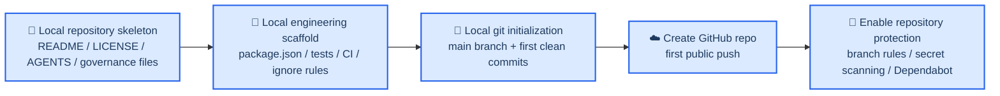

# Jixia Open Source Bootstrap Design

**Goal:** Define how `Jixia` should be initialized as a public open-source GitHub repository before feature development begins, with `AGENTS.md`, repository governance, security baselines, and a minimal engineering scaffold in place.

## 🧭 Design Summary

`Jixia` should not start as a raw code directory that later learns to behave like an open-source project. It should start as a **governance-first public repository**: the first public push should already communicate what the project is, how contributions work, what is forbidden, how security issues are reported, and what engineering boundaries contributors must follow.

The approved startup position is:

| Decision | Choice |
|---|---|
| Collaboration model | Author-led, gradually open |
| License | Apache-2.0 |
| GitHub owner | Personal account first |
| Startup route | Build the minimal public repository skeleton locally, then publish |
| AGENTS.md role | Repository-level engineering charter |

This direction is aligned with GitHub's own repository best-practice guidance: public repositories should include a README, a detectable license, contributor guidance, a code of conduct, and a security policy; they should also enable security features such as secret scanning, push protection, Dependabot alerts, and branch protection for public codebases.[^1][^2][^3]

## 🧱 Recommended Startup Shape

The first public version of `Jixia` should contain four layers.

### 1. Repository identity layer

These files define what the project is and why it exists:

- `README.md`
- `README_CN.md`
- `LICENSE`
- `AGENTS.md`

This layer must exist before the first public push. Without it, the project is visible but not legible.

### 2. Community governance layer

These files define how outside contributors and users should interact with the project:

- `CONTRIBUTING.md`
- `CODE_OF_CONDUCT.md`
- `SECURITY.md`
- `.github/ISSUE_TEMPLATE/`
- `.github/pull_request_template.md`

Because `Jixia` is starting in an author-led model, these files should be clear and welcoming, but not heavy. Major architecture changes should require prior discussion; drive-by code changes should not reshape the system boundary by accident.

### 3. Engineering guardrail layer

These files prevent the repository from becoming unsafe or inconsistent from day one:

- `.gitignore`
- `.editorconfig`
- `.gitattributes`
- a minimal CI workflow
- a documented secret-handling baseline

GitHub recommends securing public repositories with push protection, secret scanning, Dependabot alerts, and vulnerability reporting where available.[^2] For `Jixia`, these are not “later polish” items; they are part of first-public-release hygiene.

### 4. Project scaffold layer

These files give later implementation work a stable place to land:

- `docs/plans/`
- `src/`
- `tests/`
- `package.json`
- `tsconfig.json`
- `vitest.config.ts`
- a minimal `.github/workflows/ci.yml`

The first public repository does not need business logic yet, but it should not be structurally empty.

## 🔁 Initialization and Publication Order

The order matters. The repository should move through four phases.

### Phase 0: Local-first preparation

Before `git init`, prepare the repository locally with:

1. repository identity files
2. community health files
3. ignore/editor rules
4. a minimal TypeScript/Vitest scaffold
5. a minimal CI workflow

This means the first commit records a coherent repository identity, not a pile of unrelated starter files.

### Phase 1: Local git initialization

Only after the local skeleton is coherent should `git init` happen. The first commit history should establish:

- repository identity
- governance rules
- engineering guardrails
- minimal project scaffold

The first commit should be understandable on its own. Someone opening the repository history later should immediately see that `Jixia` was launched intentionally, not improvised.

### Phase 2: Create and publish the GitHub repository

Once the local repository is coherent:

1. create the GitHub repository under the personal account
2. make the first public push
3. fill repository description, topics, and homepage if applicable

GitHub documents that public repositories benefit from visible community standards and detectable licensing on the repository page.[^1][^4]

### Phase 3: Harden the public repository immediately

Immediately after the first public push, configure:

- branch protection for `main`
- secret scanning and push protection
- Dependabot alerts
- private vulnerability reporting if available
- issue and pull request templates

The public repository should not sit unprotected between first push and “later cleanup.”

## 📜 The Role of `AGENTS.md`

For `Jixia`, `AGENTS.md` should be treated as a **repository engineering charter**, not as a disposable AI prompt file.

It should sit alongside `README` and `CONTRIBUTING`, but its responsibility is different:

| File | Purpose |
|---|---|
| `README.md` / `README_CN.md` | Explain what Jixia is, who it serves, why it exists, and how to run it |
| `CONTRIBUTING.md` | Explain how humans open issues, propose changes, and submit pull requests |
| `AGENTS.md` | Explain the engineering boundaries that every executor—human or AI—must obey while changing the repo |

`AGENTS.md` should include, at minimum:

1. project identity and scope
2. top-level architecture boundaries
3. directory responsibilities
4. hard blocks such as no secrets, no bypassing verification, and no patch-style privacy logic
5. git and PR rules
6. verification expectations
7. documentation synchronization rules

It should be short enough to enforce behavior, but strong enough to prevent accidental architectural drift.

## ✅ First Public Push Acceptance Criteria

The repository is ready for its first public push only when all of the following are true:

- `LICENSE` exists and is Apache-2.0
- `README.md` and `README_CN.md` explain the project clearly
- `AGENTS.md` exists and defines repository engineering constraints
- contribution, conduct, and security files are present
- issue and PR templates are present
- `.gitignore` and basic engineering guardrails exist
- minimal CI exists
- the local repository skeleton is coherent enough that external readers immediately understand how to engage

## 🚫 Non-Goals for the Bootstrap Phase

To keep the bootstrap phase disciplined, the following are explicitly out of scope:

1. shipping real feature code before repository identity is stable
2. opening broad maintainer access on day one
3. creating a heavy-weight community governance system before any contributors exist
4. building full release automation before the repository has a stable scaffold
5. designing every future engineering rule before the first repo version exists

## ✅ Final Recommendation

The correct way to start `Jixia` is:

**Prepare a minimal but complete public-repository skeleton locally, define `AGENTS.md` as a first-class engineering charter, initialize git only after that skeleton is coherent, publish the repository under the personal GitHub account with Apache-2.0, and harden the public repo immediately after first push.**

This gives `Jixia` a clean first impression, durable engineering boundaries, and a credible open-source posture before the first feature branch ever appears.

[^1]: GitHub Docs. “Best practices for repositories.” https://docs.github.com/en/repositories/creating-and-managing-repositories/best-practices-for-repositories
[^2]: GitHub Docs. “Best practices for repositories” security section. https://docs.github.com/en/repositories/creating-and-managing-repositories/best-practices-for-repositories
[^3]: GitHub Docs. “Building communities documentation.” https://docs.github.com/en/communities
[^4]: GitHub Docs. “Licensing a repository.” https://docs.github.com/en/repositories/managing-your-repositorys-settings-and-features/customizing-your-repository/licensing-a-repository
