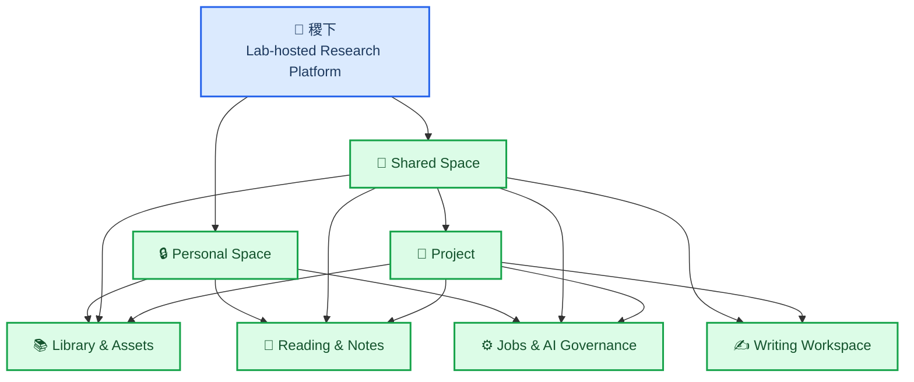
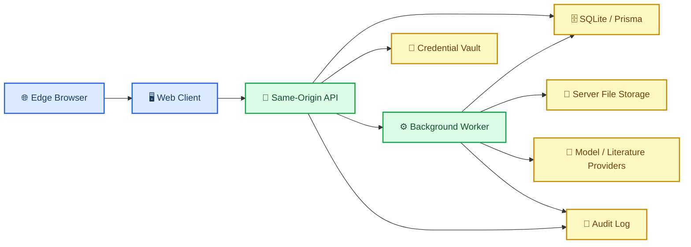
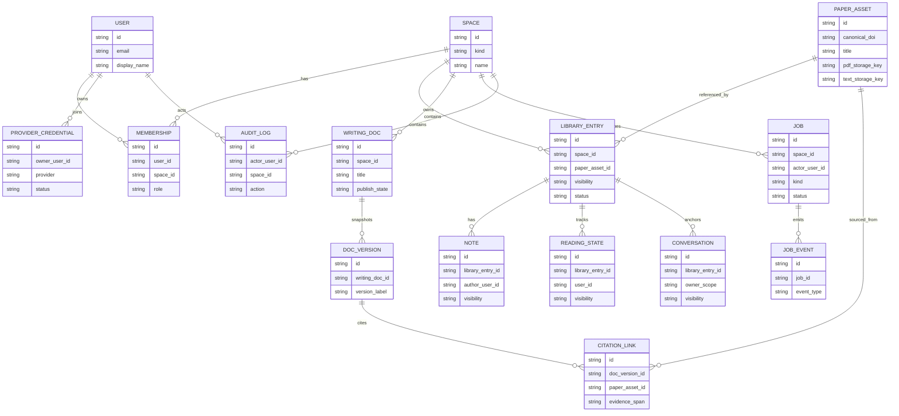
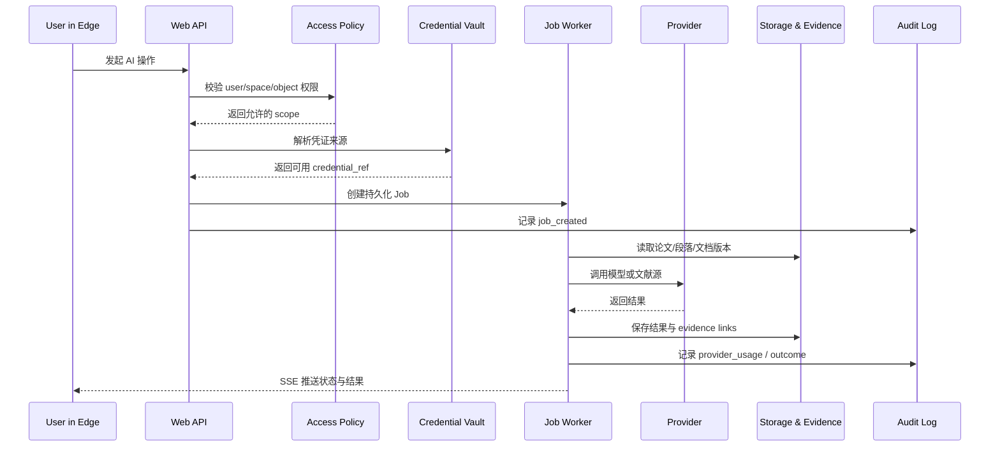
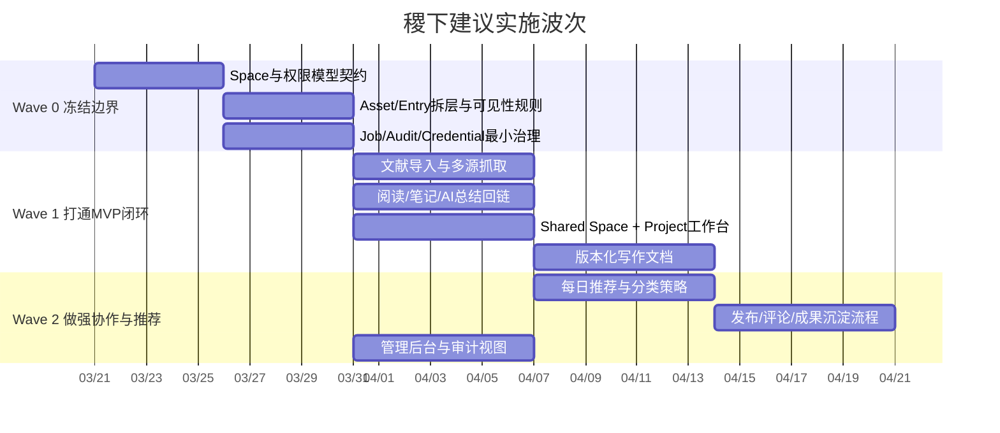

# 稷下：实验室内网协作科研平台设计稿

**Goal:** 将“稷下”定义为部署在实验室内网服务器上的、以 `Space` 为顶层容器的科研协作平台；成员通过 Edge 访问，服务器持有权威数据、后台作业、论文资产与审计记录。

## 🧭 产品定义

`稷下`不是 ResearchClaw 的多人网页版，也不是单纯的 AI 聊天入口。它应被定义为：**面向实验室团队的 server-first Web 单体科研平台**。ResearchClaw 作为能力来源与迁移参照存在，但不再决定新产品的顶层边界。

这一定义已经冻结以下四个不可逆决策：

| 决策 | 已确认选择 | 含义 |
|---|---|---|
| 数据主权 | 本地优先 + 团队真相源 | 所有权威数据、索引、作业状态都保存在实验室服务器 |
| 隐私边界 | 对象级边界 | 文献条目、笔记、对话、阅读状态、推荐信号都可独立控制可见性 |
| 协作写作 | 版本化协作 | 支持多人编辑、评论、版本历史与发布流，不追求一期做 Google Docs 级实时协同 |
| API Key 治理 | 组织兜底治理 | 成员可自带密钥，但由平台负责托管、审计、停用与基础配额治理 |

### 设计约束

1. **Web 是唯一一等入口。** Electron 如保留，只能作为后续可选宿主，不再反向塑造核心领域。
2. **服务器是真相源。** 权威论文资产、解析文本、embedding 原材料、写作文档、作业与审计都由实验室服务器持有。
3. **可去重的是资产，不是行为。** 同一篇论文可被多个空间引用，但阅读进度、私人批注、AI 对话上下文、推荐输入信号不自动共享。
4. **一期聚焦团队科研闭环。** 重点是文献收集、阅读理解、团队共享、版本化写作与治理；不做全能科研操作系统。

## 🏛️ 推荐架构

推荐将 `稷下` 实现为 **server-first Web 单体**，以与 ResearchClaw 相近的 TypeScript 技术栈快速承接已有能力，但重新划定领域模型与传输边界。

### 运行时分层

1. **Web Client**：浏览器中的 React 应用，负责空间、文献、阅读、写作和作业可视化。
2. **Same-Origin API**：提供对象级权限检查、读写 API、SSE 事件流。
3. **Background Workers**：执行导入、解析、摘要、推荐、索引、批量写作辅助等持久化任务。
4. **Storage Layer**：以 SQLite/Prisma 作为一期权威数据库，论文原件与抽取文本落在服务器文件系统，数据库只保存相对 storage key。
5. **Governance Layer**：统一处理凭证引用、审计、配额、失败恢复与人工重试。

### 与 ResearchClaw 的关系

**应优先迁移：**

- 论文导入与解析链
- 阅读摘要、AI 对话、读书笔记生成链
- 已有的页面信息架构经验
- shared contract 的组织方式
- same-origin Web runtime 的落地经验

**不应直接继承：**

- Electron-first 的宿主假设
- 单用户 `Paper` 直挂阅读行为的模型
- 宿主机本地路径与桌面加密能力假设
- 进程内内存态作业模型
- 把 `Project` 当顶层权限容器的语义

## 🧱 领域边界与数据归属

领域模型的核心原则是：**资产全局复用，行为作用域化。**

### 核心 bounded contexts

| Context | 责任 | 一期是否必须 |
|---|---|---|
| `Spaces & Access` | 用户、空间、成员关系、角色、对象级可见性策略 | 是 |
| `Library & Assets` | 论文资产、导入记录、空间内文献条目、标签与状态 | 是 |
| `Reading & Notes` | 阅读状态、批注、AI 阅读对话、结构化洞见 | 是 |
| `Collaboration & Writing` | 写作文档、版本、评论、发布流、引用证据 | 是 |
| `Jobs & AI Governance` | 背景作业、作业事件、凭证引用、审计、失败恢复 | 是 |
| `Literature Connectors` | PubMed、arXiv、DOI、URL、PDF 导入与抓取适配层 | 是 |

### 推荐数据模型

### 为什么必须拆成 `PaperAsset` 与 `LibraryEntry`

`PaperAsset` 代表服务器上的可去重论文资产：元数据、PDF、抽取文本、embedding 原材料。`LibraryEntry` 代表“某个空间如何引用这篇论文”——它携带状态、标签、可见性与上下文归属。这样一来：

- 共享项目可以复用同一个论文资产
- 个人阅读进度仍然可以保持私有
- 某条结构化总结可以被显式发布到共享空间
- 推荐信号不会因为共享论文而自动全团队混用

### 可见性策略

一期建议只支持三种 visibility：

- `private`：仅作者或拥有者可见
- `space_shared`：当前空间内成员可见
- `published_to_project`：作为项目成果显式发布给项目上下文

对应地，一期明确 **不做**：

1. 通用文件系统 ACL 平台
2. 一个对象天然同时属于多个共享空间的复杂归属模型

## 🤖 AI、作业与治理模型

`稷下`中的 AI 不是前端直连供应商的快捷调用，而是**带作用域、凭证来源、输入记录、输出回链与审计责任的服务器端作业**。

### 核心治理原则

1. **所有 AI 行为必须是持久化 Job。**
2. **业务域只持有 `credential_ref`，不传播明文 key。**
3. **AI 输出默认要求证据回链。**
4. **失败必须可恢复、可重试、可审计。**

### API Key 托管策略

支持两类凭证来源：

- `org_managed credential`
- `user_managed credential`

但无论哪一类，平台都负责：

- 加密存储
- 审计
- 停用与撤销
- 基础配额与熔断开关
- 通过 `credential_ref` 引用，而非在 job payload 里扩散明文

### 证据回链要求

以下 AI 输出一期建议默认强制带来源信息：

- 结构化摘要
- 标签与分类建议
- 读书笔记生成
- 写作辅助文本
- 每日推荐原因说明

## 🚧 实施阶段与 MVP 收敛

稷下应按**风险消除顺序**推进，而不是按菜单堆功能。核心原则是：先冻结最贵的边界，再打通最小科研闭环，最后叠加推荐和运营增强。

### Wave 0：冻结最贵的结构

Wave 0 不追求页面丰富，而是追求后续不返工。必须先固化三层契约：

1. `Spaces & Access`：用户、空间、成员关系、角色、对象级可见性
2. `Library & Assets`：`PaperAsset` / `LibraryEntry` 拆层、导入、去重、发布关系
3. `Jobs & Governance`：`ProviderCredential`、`Job`、`JobEvent`、`AuditLog`

### Wave 1：打通实验室最小闭环

一期真正要跑通的是：

**导入文献 → 进入个人/共享空间 → 阅读与 AI 总结 → 发布共享洞见 → 进入共享写作稿件**

这条链路一旦稳定，稷下就已经从概念变成真正可用的实验室工具。

### Wave 2：增强推荐与运营能力

第二波再叠加：

- 每日推荐与分类策略
- 成果发布与沉淀流程
- 管理后台与审计视图

这意味着**推荐系统不是一期入口，而是二阶段乘法器**。

## 🚫 明确非目标

为避免范围漂移，一期设计稿明确不包含以下目标：

1. Google Docs 级实时多人光标同步
2. 通用代码 IDE / SSH 执行平台
3. 面向公网的多租户 SaaS
4. 复杂财务计费系统
5. 开放式 provider / connector 插件市场

## ❓仍需后续补充的实现细节

以下问题不会改变产品大边界，但会影响具体实现顺序，应在执行前进一步冻结：

1. 一期的身份引导方式：实验室管理员预置用户、邀请码、还是最简本地账号体系
2. 写作文档的内部表示：Markdown first、block-based、还是混合结构
3. 每日推荐的优先目标：偏个人兴趣、偏项目推进价值、还是混合权重
4. PubMed / arXiv / DOI / URL / PDF 这几条导入链路的一期优先级排序

## ✅ 当前结论

可以把 `Jixia` 作为一个新产品独立推进，但正确姿势不是“完全从零重写所有东西”，而是：**新建核心边界，择优迁移成熟能力**。`Space` 是顶层容器；`Project` 退到共享空间内部；`PaperAsset` 与 `LibraryEntry` 分层；AI 能力被约束在持久化 Job 和治理责任之下；MVP 聚焦实验室团队科研闭环，而不是追求功能大全。
