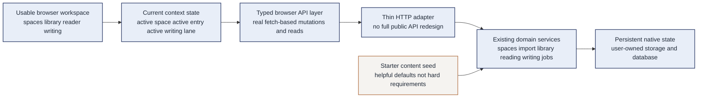

# Jixia Usable Native Demo Design

**Goal:** Redefine `demo-native-showcase` from a guided showcase into a usable, space-first, single-tenant Jixia demo that can run on the current server without sudo or Docker and can realistically make operator packaging the next major gap.

**Branch target:** `demo-native-showcase`

**Operating constraint:** The current host has no sudo access and no container runtime. The demo therefore must succeed through native Node startup, user-owned storage paths, and repo-contained setup while still feeling like a real product rather than a four-step tour.

---

## Current context

- The branch already has truthful server-backed data flow for spaces, import, library, reader, writing, and governed jobs.
- The current UX is still shaped around `nativeDemoFixture` and one pre-scripted corridor: one actor, one shared space, one project slug, one seed document, one preferred walkthrough path.
- `src/server/http-api.ts` is still fixture-centric, which makes the product feel like a prepared exhibit instead of an actually usable workspace.
- The browser pages are data-backed, but they still behave like checkpoints in a demo script instead of durable tools that a user can move between freely.
- The strongest existing assets are already present: native runtime, deterministic reset, import flow, persisted notes/insights, persisted writing state, and governed-job evidence.

The problem is therefore **not** that the branch is fake. The problem is that it is **too tightly curated**. The next move is to broaden it into a **usable single-tenant product demo**, not to restart from scratch.

## The real requirement

The demo should satisfy this standard:

> A reviewer can use Jixia as a real, space-first workspace on this server, with persistent state and non-linear re-entry, and the branch can credibly argue that packaging is the next major gap only after create/open/reopen flows are verified.

That means the target is no longer “show one truthful storyline.” The target is “ship one truthful, stateful, usable product slice.”

## Constraints and success criteria

### Constraints

- no sudo
- no Docker or Podman on the target host
- no dependence on real external scholarly APIs during the demo
- no fake browser-only state that breaks the server-first model
- no pretending that missing domain models already exist
- no root-owned runtime paths during setup or rehearsal

### Success criteria

The demo is successful when a user can do all of the following without being forced through a rigid sequence:

1. open Jixia and see existing spaces or create a new usable space
2. enter a chosen space and stay in that context while moving between library, reader, and writing
3. import multiple papers into the current space and revisit them later from the library
4. open any imported library entry in the reader rather than only a preselected one
5. create notes and insights, then refresh or re-enter the reader and still see them
6. open the writing workspace independently, save draft content, reload it, and publish it
7. optionally run a governed summary job and inspect audit or event artifacts
8. restart the app or re-open the browser and find the same state again until reset is explicitly requested

The admin-facing message should become:

1. **The product is already usable here in native mode.**
2. **The remaining gap is packaging, supervision, and deployment hygiene.**
3. **Docker support improves operations; it is not what creates product value.**

## Approaches considered

| Approach | What it means | Strength | Weakness | Recommendation |
| --- | --- | --- | --- | --- |
| Polished guided showcase | Keep the current seeded path but make it look smoother | Smallest delta | Still fails the user’s actual requirement because it remains a tour | Reject |
| **Usable single-tenant, space-first demo** | One operator, real persisted state, multiple spaces and entries, free re-entry, honest limitations on unsupported areas | Strongest fit for the current requirement and host constraints | Requires reshaping the branch goal and removing fixture-centric assumptions | **Recommend** |
| Near-production multi-user product | Add auth, richer admin tools, broader APIs, deployment polish, and less curated data | Closest to final product | Too large, wrong sequencing, and not necessary to justify operator help | Defer |

## Recommended direction

Build `demo-native-showcase` into a **usable single-tenant, space-first Jixia demo** with this product shape:

`Spaces -> Library -> Reader -> Writing` remains the core loop, but it must become **non-linear** and **stateful**.

The demo should behave like this:

- Spaces are real persisted contexts, not just the first slide in a presentation.
- Library is a real working shelf where multiple imports accumulate over time.
- Reader is a reusable evidence workspace that can open whichever library entry the user chooses.
- Writing is an ongoing workspace for the current space, not only the final page in a script.
- Governed jobs remain optional value-add, not the thing that makes the demo feel complete.

## What “usable” means in this branch

“Usable” does **not** mean “production-complete.” It means:

- the browser is free to move between pages in any order
- the current space and current work context are clear
- imported literature accumulates and can be revisited
- notes, insights, and drafts persist and can be reloaded
- empty, loading, and error states are honest
- the app still works after a restart unless the operator deliberately resets it

It does **not** require all future product surface area such as full auth, true project management, role administration UI, or production credential workflows.

## What must be proven before we say “packaging is next”

Before this branch can honestly claim that Docker/operator support is the main remaining gap, it must first prove all of the following in native mode:

1. a user can create or choose a space
2. that space can be opened and reused later
3. imports accumulate in that space over time
4. reader notes/insights survive refresh and re-entry
5. writing state survives reload and restart

If any of those are still missing, the branch is still missing product behavior, not only packaging.

## Honest product boundary for the demo

To avoid fake completeness, the demo should explicitly adopt these boundaries:

### 1. Single-tenant, actor-fixed demo runtime

The operator identity can remain fixed for now. The problem is not that `demo-operator` exists; the problem is that the whole UI currently feels hardwired to one scripted story. Keep the fixed actor, but allow that actor to actually use the system.

### 2. Space is first-class; project is not yet

The backend currently has a real `space` model but not a first-class persisted `project` model. The demo should stop over-promising here.

Recommended treatment:

- keep the internal route shape if needed for compatibility
- present the user-facing concept as a **workspace** or **current drafting lane** inside a space
- avoid pretending the product already supports arbitrary project administration if the backend does not

### 3. Fixture becomes starter content, not the whole world

`shared-space`, `tumor-board`, `pmid:123456`, and `doc-1` should remain useful seeded defaults after reset, but they should no longer define the only meaningful way to use the app.

## Demo storage contract

The demo must continue to use **user-owned** storage and database paths so the native experience stays frictionless:

- `JIXIA_STORAGE_ROOT=/home/zhurui/.local/share/jixia-demo/storage`
- `JIXIA_DATABASE_URL=file:/home/zhurui/.local/share/jixia-demo/data/jixia-demo.db`
- `JIXIA_HOST=127.0.0.1`
- `JIXIA_PORT=3000`

The reset command should restore a clean starter workspace, but ordinary usage should **not** depend on reset. Reset is for rehearsal, not for every session.

## Usable-demo architecture

## Product scope for this revised demo

### In scope

#### 1. Real space usage

- list available spaces
- create at least one new space through the UI or an adjacent control
- enter any listed space
- persist that space and reopen it later

#### 2. Real library usage

- import multiple DOI / PMID / arXiv records into a space
- see the full accumulated library list
- open any listed entry from the library
- revisit previously imported entries without reset

#### 3. Real reader usage

- open reader from an arbitrary chosen library entry
- add multiple notes and insights
- refresh and re-read to prove persistence
- keep a visible path back to library and forward to writing

#### 4. Real writing usage

- open writing workspace independently from the reader
- save and reload draft content
- transition publish state
- retain the current draft across restarts until reset

#### 5. Optional governed-job usage

- expose governed summary as an optional action once the main flow is already stable
- show at least one event or audit artifact

#### 6. Non-linear navigation

- lightweight persistent navigation between spaces, library, reader, and writing
- current context visible in the UI
- no requirement to follow one pre-authored click order

### Out of scope

- multi-user login and session management
- production credential management UI
- first-class project administration if the backend model still does not exist
- PDF upload pipeline hardening beyond what the current service layer already supports
- Docker packaging, reverse proxy, TLS, and system-service automation

## Concrete user stories the revised demo must support

### Story 1: Start from scratch and make a space usable

Open Jixia, create or choose a space, and enter it without being forced into a canned shared-space narrative.

### Story 2: Build a real library shelf

Import more than one paper, see multiple entries accumulate, and choose which one to read next.

### Story 3: Use the reader as a workspace, not a slide

Save notes and insights, leave the page, return later, refresh, and still find the same evidence state.

### Story 4: Use writing as an ongoing workspace

Open the writing surface because you want to draft, not because the tour tells you it is “the next step.” Save, reload, publish, and continue editing later if needed.

### Story 5: Optional governance proof

Run a governed summary when you want to demonstrate auditability, not because the app feels incomplete without it.

## Design decisions

### Decision 1: Replace “tour checkpoints” with “working surfaces”

Each page must function independently enough that a user can enter it for a real reason, not only as the next step in a narrative.

### Decision 2: Keep the fixed actor, remove the fixed story

The operator identity can remain seeded. What must change is the assumption that the operator only ever uses one fixed space, one fixed entry, and one fixed document.

### Decision 3: Keep seed data as a baseline, not a cage

Reset should restore a rich starter state, but new spaces, new imports, and new work should accumulate naturally until the operator chooses to reset.

### Decision 4: Be honest about unsupported domain models

If project management is not actually first-class yet, hide or rename that concept in the usable demo rather than pretending it is complete.

### Decision 5: Make persistence and re-entry a first-class credibility signal

The strongest proof of usability is not a mutation button. It is the ability to leave, reload, reopen, and keep working.

## Risks and mitigations

| Risk | Why it matters | Mitigation |
| --- | --- | --- |
| Branch keeps the old showcase architecture under a new label | User will still feel the scripted nature immediately | Re-scope the docs and tests around non-linear usage, not walkthrough-only success |
| Space creation becomes fake or purely client-side | Violates the server-first model | Use existing server routes and persist state through the real app runtime |
| Project semantics remain misleading | Demo appears fuller than it really is | Collapse user-facing language to “workspace” until a true project model exists |
| Reader and writing still depend on route-forward storytelling | Product feels chained together | Add current-context controls and only as much navigation as the existing routed surfaces can honestly support |
| Reset remains required for every impressive moment | Demo feels fragile | Treat reset as rehearsal support only; everyday use must work without it |
| Jobs consume too much scope | Core usability slips again | Keep governed jobs explicitly optional until spaces/library/reader/writing are strong |

## Definition of done for the revised design

This revised design is correctly executed when the branch supports all of the following on the current server without sudo:

- native startup and persistence using user-owned paths
- real spaces that can be listed and used, not only one scripted seed space
- a library that accumulates multiple imports over time
- arbitrary entry selection into the reader
- reader notes and insights that survive refresh and re-entry
- writing state that survives reload and restart
- navigation that lets the user move around the product without following one forced corridor
- an honest statement that the main missing step after this is deployment packaging, not product substance

## Why this is the right correction

The user’s feedback is correct: the current branch already proves truthfulness, but not full usability.

The right correction is **not** to throw away the branch. It is to evolve it from:

- **guided, fixture-centric showcase**

into:

- **usable, stateful, single-tenant product demo**

That preserves the strongest work already done while aligning the branch with the real requirement: a demo that only lacks Docker packaging, not real product behavior.
