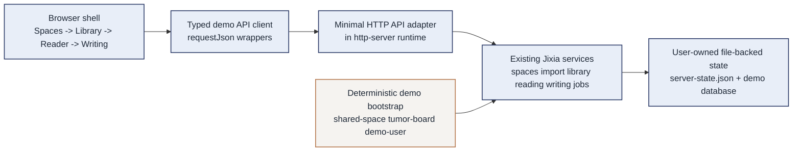

# Jixia Native Demo Showcase Design

**Goal:** Define a truthful, persuasive Jixia demo that can run on the current server without sudo or Docker, demonstrate real product value, and strengthen the case for later admin-supported deployment work.

**Branch target:** `demo-native-showcase`

**Operating constraint:** The current host has no sudo access and no container runtime. The demo therefore must succeed with a native Node startup path, user-owned storage paths, and zero dependence on administrator intervention during the walkthrough.

---

## Current context

- `task10-layered-ui` already delivers the first scholarly browser shell.
- Task 11 already added native Node startup, build artifacts, Docker scaffolding, and bilingual operator docs.
- The browser shell still uses mostly static placeholder content.
- The service layer already contains meaningful domain behavior for spaces, import, library entry detail, reading, writing, governed jobs, audit records, and job events.
- `src/server/http-server.ts` currently exposes `GET /health` plus static asset serving, but not the business routes the browser would need.
- Import connectors for PubMed and arXiv are deterministic local placeholders, which is a strength for a repeatable offline demo.

This means the fastest convincing path is **not** more infrastructure work. It is a **native Node vertical slice** that turns the current shell into a real browser-driven product walkthrough.

## Constraints and success criteria

### Constraints

- no sudo
- no Docker or Podman on the target host
- no dependence on external scholarly APIs during the demo
- no fake front-end-only data that would undermine credibility
- no large architectural detour away from the current server-first model
- no root-owned runtime paths during the demo setup

### Success criteria

The demo is successful if a reviewer can watch one operator session and see all of the following happen through the browser:

1. enter a real shared space
2. import a paper using a deterministic locator
3. see that paper appear in the library list
4. open the reader and create at least one note and one generated insight
5. refresh or re-fetch and prove those reading artifacts still exist
6. open writing, save content, transition publish state, and re-read the latest document state successfully
7. optionally run one governed job and inspect at least one audit or event artifact

The story must be strong enough that the next ask is not “please let me install Docker because development is annoying,” but “the product already works in native single-node mode and now needs controlled operator support for team-grade deployment.”

## Approaches considered

| Approach | What it means | Strength | Weakness | Recommendation |
| --- | --- | --- | --- | --- |
| Static shell walkthrough | Keep the current Task 10 shell and narrate the missing behavior manually | Fastest possible | Weak evidence; obvious placeholders reduce credibility | Reject |
| Native Node vertical slice | Add only the HTTP adapters, read models, demo seed/reset flow, and browser wiring needed for one truthful workflow | Strong value proof, works on this server, aligns with current architecture | Requires focused product work before infra work | **Recommend** |
| Near-production full stack | Push for a broader API, richer UX, and deployment polish immediately | More complete long-term shape | Wrong sequencing under host constraints; delays admin persuasion | Defer |

## Recommended direction

Build a dedicated **Jixia Native Demo Showcase** on branch `demo-native-showcase` with this primary workflow:

`Shared Space -> Import Paper -> Library -> Reader Note / Insight -> Writing Save / Publish -> Governed Job / Audit (optional finale)`

This demo should be:

- **native**: starts with `npm run build` and `npm run start:server`
- **truthful**: real server-side state mutation, not local front-end mock state
- **repeatable**: deterministic bootstrap and reset path comes first, before the walkthrough begins
- **offline-friendly**: relies on existing local placeholder connectors for import
- **persistence-visible**: key mutations are proven again after a fresh read or refresh
- **persuasive**: highlights why operator support matters only after the core product already proves value

## Demo storage contract

The demo must use **user-owned** storage and database paths so the first-run experience demonstrates product value instead of permission friction.

Recommended defaults for the walkthrough:

- `JIXIA_STORAGE_ROOT=/home/zhurui/.local/share/jixia-demo/storage`
- `JIXIA_DATABASE_URL=file:/home/zhurui/.local/share/jixia-demo/data/jixia-demo.db`
- `JIXIA_HOST=127.0.0.1`
- `JIXIA_PORT=3000`

These paths are not presented as permanent production choices. They are the lowest-friction native proof that Jixia can run, persist state, and recover deterministically on this server without admin help.

## Demo architecture

## Demo scope

### In scope

#### 1. Deterministic bootstrap and reset comes before the walkthrough

Provide a predictable demo world with:

- `demo-user`
- `shared-space`
- `tumor-board`
- at least one stable importable paper locator such as `pmid:123456`
- one documented reset path that returns the demo to the same baseline every time

#### 2. Minimal business HTTP surface

Expose only the routes needed by the scripted browser flow. Do not attempt a full public API design yet.

Recommended surface:

- spaces list / memberships
- create shared space if absent
- import paper by locator
- list library entries for a fixed space/project
- fetch one library entry detail
- fetch reading detail
- create note
- save generated insight
- create writing document if absent
- fetch current writing document detail
- save document version
- transition publish state
- create and run a governed job
- list audit records or job events for the current job

#### 3. Real browser data flow

Replace current placeholder panels with:

- actual loading states
- actual empty states
- actual success and failure messages
- actual persisted mutations visible after refresh or re-fetch

#### 4. Admin-facing showcase script

The repo should contain a short runbook that lets you:

- reset the demo
- start the service with user-owned paths
- click through the narrative in a fixed order
- explain why Docker or operator support is the next step rather than the first step

### Out of scope

- a generalized production REST API
- fully dynamic multi-user auth
- reverse proxy, TLS, or system service management on this server
- replacing placeholder scholarly connectors with true upstream integrations
- redesigning Task 10 visual direction

## Concrete demo storyline

### Scene 1: Enter Jixia as a scholarly collaboration space

Open the Spaces page and show a real shared space rather than static copy. The message should be: **Jixia is not a dashboard toy; it is a research workspace with governed collaboration boundaries.**

### Scene 2: Import a paper without external dependency risk

On the Library page, import a paper via a deterministic PMID or arXiv locator. The page should then immediately show the new entry in the real library list. The message should be: **the system can ingest research assets reproducibly on this host.**

### Scene 3: Turn reading into structured evidence

Open the Reader page, add a note, and save one generated insight. Then refresh or trigger a fresh read and prove the saved artifacts still exist. The message should be: **Jixia is not just file storage; it converts reading into reusable evidence.**

### Scene 4: Turn evidence into writing state

Open Writing, create or load a document, save content, and transition publish state. Then re-open or re-fetch the document and prove the latest state persists. The message should be: **the system carries context from reading into governed writing.**

### Scene 5: Optional finale with governed jobs

Run one governed job and show an audit record or event trail. The message should be: **AI work is supervised, attributable, and not an opaque side effect.**

## Design decisions

### Decision 1: Keep the server-first boundary intact

Do not move demo state into front-end local storage. The browser is only a client of the already-existing server behavior.

### Decision 2: Prefer a thin HTTP adapter over a broad API redesign

This demo is a bridge from Task 10 shell to truthful runtime behavior. It is not the moment to redesign transport architecture.

### Decision 3: Seed deterministic demo data before relying on fixed IDs in the walkthrough

Manual prep creates demo drift. A seed/reset path keeps the showcase reliable and makes admin conversations easier.

### Decision 4: Make persistence visible after a fresh read

Successful mutations alone are not persuasive enough. The demo must show that notes and writing state survive a new read, a refresh, or a re-entry into the same page.

### Decision 5: Treat governed jobs as an optional but high-value flourish

The core persuasion path is import -> reader -> writing. Jobs should strengthen the ending, not block the main narrative.

## Risks and mitigations

| Risk | Why it matters | Mitigation |
| --- | --- | --- |
| Demo turns into general API project | Slows delivery and diffuses scope | Limit to one browser walkthrough and its exact endpoints |
| Library page still cannot show real data | Admin sees placeholders instead of product value | Add list read model before UI rewiring |
| Writing can save but not reload convincingly | Demo feels partial | Add explicit writing detail/snapshot read path plus refresh-visible proof |
| Demo reset is manual and brittle | Live showcase risk | Add a dedicated reset/bootstrap mechanism before fixed-ID assertions |
| Demo setup requires privileged paths | First impression becomes permissions trouble | Lock user-owned storage/database paths in runbook and env guidance |
| Job demo distracts from main flow | Time risk | Keep jobs optional until core slice is green |

## Definition of done for the design

This design is considered correctly executed when the implementation branch can support all of the following on the current server without sudo:

- start Jixia natively with one documented command sequence
- show real spaces and library data in the browser
- import a paper through the browser and persist it
- create reading artifacts and prove they survive a fresh read
- create or update writing state and prove it survives a fresh read
- reset the demo back to a known state with user-owned paths
- walk an admin through the value story in less than ten minutes

## Why this is the right sequencing for admin persuasion

The strongest admin conversation starts from proof:

1. **The product already runs here in native mode.**
2. **Its core collaborative workflow is real, persistent, and browser-driven.**
3. **The remaining gap is operator-grade packaging, isolation, and team-scale supervision.**

That framing is much stronger than asking for Docker privileges before demonstrating concrete value.
