# Jixia Task 11 Deployment Implementation Plan

> **For Claude:** REQUIRED SUB-SKILL: Use superpowers:executing-plans to implement this plan task-by-task.

**Goal:** Keep Jixia reproducibly runnable as a lab-server package with a minimal native Node current-host startup path, optional Docker/Compose packaging scaffolding, an explicit `/health` readiness contract plus the API-scoped `/api/health` mirror, and bilingual operator documentation that matches the real integrated workbench runtime.

**Architecture:** Task 11 should stay narrow. Do not refactor the domain model or invent a second deployment story. Instead, keep the thinnest truthful runtime that can start Jixia natively on Node 22, expose `/health`, serve the built integrated workbench shell, and document persistent storage/database/key locations for operators. Docker and compose should encode optional packaging for that same runtime on Docker-capable hosts, while smoke tests lock the operator contract so later work can focus on migration checkpoints rather than startup confusion.

**Tech Stack:** Node.js 22, TypeScript, Vite, Vitest, native `node:http`, Docker, Docker Compose, existing `createJixiaApp()` server state helpers.

---

## Current deployment baseline

- Branch: `main`
- Current verification baseline: `npm test`, `npm run typecheck`, and `npm run build` pass.
- `src/server/http-server.ts` is the real Node HTTP listener behind `npm run start:server` and serves both `/health` and `/api/health` with `{ "service": "jixia-server", "status": "ok" }`.
- `src/server/runtime-config.ts` is the runtime source of truth for `JIXIA_STORAGE_ROOT`, `JIXIA_DATABASE_URL`, `JIXIA_HOST`, and `JIXIA_PORT`.
- `.env.example` remains placeholder-only, with `YOUR_...` values plus operator guidance comments.
- `README.md`, `README_CN.md`, and `docs/runbooks/native-demo-showcase.md` now function as the active operator/current-host runbooks.
- `Dockerfile`, `docker-compose.yml`, `.dockerignore`, and `tests/smoke/deploy-docs.test.ts` already exist and define the current packaged runtime path.

## Non-goals

- no transport-wide API redesign
- no live browser-to-server data integration beyond what is needed to make the shell runnable
- no Kubernetes, reverse proxy, or production HA work
- no secret values committed to the repository or compose defaults

## Execution flow

```mermaid
flowchart LR
    accTitle: Task 11 Deployment Flow
    accDescr: Task 11 should lock deployment expectations in tests, add a minimal native Node runtime startup path, add optional Docker scaffolding, document operator steps, and then verify the full repository plus container configuration where Docker is available.

    contract["Deployment smoke contract"]
    runtime["Runtime config and HTTP entrypoint"]
    container["Dockerfile compose and ignore rules"]
    docs["Env example and bilingual operator docs"]
    ci["CI build guardrail"]
    verify["Full verification and operator handoff"]

    contract --> runtime --> container --> docs --> ci --> verify

    classDef primary fill:#e8eef8,stroke:#2b3a67,stroke-width:1.5px,color:#1f2937
    classDef support fill:#f5f3f0,stroke:#b5774d,stroke-width:1.5px,color:#1f2937

    class contract,runtime,container,docs,ci,verify primary
```



## Implementation notes before execution

1. Keep the integrated workbench shell intact. Task 11 is about keeping it runnable and operable, not redesigning pages.
2. The server runtime must stay aligned with the server-first boundary. Keep only the minimal Node HTTP layer needed to expose health and serve the built shell.
3. Because server code currently imports `@shared/*` aliases, prefer a dedicated server Vite build config over a plain `tsc` emit path that would leave unresolved aliases in runtime output.
4. `.env.example` must stay secret-safe and continue satisfying `tests/smoke/guardrails.test.ts`, which currently expects `YOUR_` placeholders to remain present.
5. Docker health/readiness must follow the same `/health` contract described in the READMEs and current-host runbook; `/api/health` remains the API-scoped mirror for browser/API handoff checks.

### Task 1: Lock the Task 11 deployment contract in smoke tests

**Files:**
- Create: `tests/smoke/deploy-docs.test.ts`

**Step 1: Write the failing test**

Create `tests/smoke/deploy-docs.test.ts` to lock the deployment/operator contract before adding runtime code. Start with assertions for the runtime and docs expectations that are currently missing:

```ts
import { existsSync, readFileSync } from 'node:fs';
import { describe, expect, it } from 'vitest';

function read(filePath: string): string {
  return readFileSync(filePath, 'utf8');
}

describe('deployment and operator scaffolding', () => {
  it('declares a runnable server build path', () => {
    const packageJson = JSON.parse(read('package.json')) as {
      scripts?: Record<string, string>;
    };

    expect(packageJson.scripts?.['build:server']).toBeTruthy();
    expect(packageJson.scripts?.['start:server']).toBeTruthy();
  });

  it('includes Docker deployment artifacts', () => {
    expect(existsSync('Dockerfile')).toBe(true);
    expect(existsSync('.dockerignore')).toBe(true);
    expect(existsSync('docker-compose.yml')).toBe(true);
  });

  it('documents operator-critical environment and startup details', () => {
    const readme = read('README.md');
    const readmeCn = read('README_CN.md');
    const envExample = read('.env.example');

    expect(envExample).toContain('JIXIA_STORAGE_ROOT=YOUR_STORAGE_ROOT');
    expect(envExample).toContain('JIXIA_DATABASE_URL=YOUR_DATABASE_URL');
    expect(readme).toContain('JIXIA_STORAGE_ROOT');
    expect(readme).toContain('JIXIA_DATABASE_URL');
    expect(readme).toContain('npm run start:server');
    expect(readmeCn).toContain('JIXIA_STORAGE_ROOT');
    expect(readmeCn).toContain('JIXIA_DATABASE_URL');
    expect(readmeCn).toContain('npm run start:server');
  });
});
```

**Step 2: Run test to verify it fails**

Run: `npm run test -- tests/smoke/deploy-docs.test.ts`

Expected: FAIL because runtime scripts and Docker artifacts do not exist yet, and the readmes do not contain operator startup instructions.

**Step 3: Write minimal implementation**

Do not implement anything else yet. Keep the failing smoke test in place as the Task 11 contract.

**Step 4: Run test to verify it still fails for the right reasons**

Run: `npm run test -- tests/smoke/deploy-docs.test.ts`

Expected: FAIL only on missing runtime/docs artifacts, not on syntax or import errors in the new test file.

**Step 5: Commit**

```bash
git add tests/smoke/deploy-docs.test.ts
git commit -m "test: lock deployment operator contract"
```

### Task 2: Add a minimal server runtime path and package scripts

**Files:**
- Create: `src/server/runtime-config.ts`
- Create: `src/server/http-server.ts`
- Create: `vite.server.config.ts`
- Modify: `src/server/index.ts`
- Modify: `package.json`
- Modify: `tests/smoke/deploy-docs.test.ts`

**Step 1: Extend the failing test**

Update `tests/smoke/deploy-docs.test.ts` so it also proves the runtime config contract is concrete, not just documented:

```ts
import { readRuntimeConfig } from '../../src/server/runtime-config';

it('normalizes runtime config for the lab server process', () => {
  expect(
    readRuntimeConfig({
      JIXIA_DATABASE_URL: 'file:/var/lib/jixia/data/jixia.db',
      JIXIA_HOST: '0.0.0.0',
      JIXIA_PORT: '3000',
      JIXIA_STORAGE_ROOT: '/var/lib/jixia/storage',
    }),
  ).toMatchObject({
    databaseUrl: 'file:/var/lib/jixia/data/jixia.db',
    host: '0.0.0.0',
    port: 3000,
    storageRoot: '/var/lib/jixia/storage',
  });
});
```

**Step 2: Run test to verify it fails**

Run: `npm run test -- tests/smoke/deploy-docs.test.ts`

Expected: FAIL because `src/server/runtime-config.ts`, runtime scripts, and the HTTP entrypoint do not exist yet.

**Step 3: Write minimal implementation**

Implement the smallest truthful runtime layer:

- `src/server/runtime-config.ts`
  - read `JIXIA_STORAGE_ROOT`, `JIXIA_DATABASE_URL`, `JIXIA_HOST`, and `JIXIA_PORT`
  - provide safe defaults consistent with the current repository (`.jixia-storage`, `file:./prisma/dev.db`, localhost bind, fixed port)
  - export a typed `readRuntimeConfig()` helper
- `src/server/http-server.ts`
  - create a minimal `node:http` server
  - call `createJixiaApp()` once at startup
  - expose `GET /health` via `app.health.getHealth()` and keep `GET /api/health` as the same API-scoped health mirror
  - serve built assets from `dist/` when they exist
  - fall back to `dist/index.html` for non-API shell routes (`/spaces`, `/spaces/:id/library`, etc.)
- `vite.server.config.ts`
  - build the Node server entrypoint with alias resolution for `@shared/*`
  - emit to `dist-server/`
- `package.json`
  - split web and server build commands explicitly
  - expected scripts:
    - `build:web`: `vite build`
    - `build:server`: `vite build --config vite.server.config.ts`
    - `build`: `npm run build:web && npm run build:server`
    - `start:server`: `node dist-server/http-server.js` (or the emitted filename from the server build)
- `src/server/index.ts`
  - keep `createJixiaApp` export intact
  - re-export the runtime config and/or startup helper if that improves discoverability

Do **not** add live data fetching to the browser in this task.

**Step 4: Run test to verify it passes**

Run: `npm run test -- tests/smoke/deploy-docs.test.ts`

Expected: PASS for runtime config and script assertions, while Docker/docs assertions may still fail until later tasks.

**Step 5: Commit**

```bash
git add src/server/runtime-config.ts src/server/http-server.ts src/server/index.ts vite.server.config.ts package.json tests/smoke/deploy-docs.test.ts
git commit -m "feat: add jixia runtime startup path"
```

### Task 3: Add Dockerfile, compose, and Docker ignore rules

**Files:**
- Create: `Dockerfile`
- Create: `.dockerignore`
- Create: `docker-compose.yml`
- Modify: `tests/smoke/deploy-docs.test.ts`

**Step 1: Extend the failing test**

Add assertions that check the Docker scaffolding content, not just file existence:

```ts
it('defines a dockerized operator path', () => {
  const dockerfile = read('Dockerfile');
  const compose = read('docker-compose.yml');

  expect(dockerfile).toContain('FROM node:22');
  expect(dockerfile).toContain('npm run build');
  expect(compose).toContain('JIXIA_STORAGE_ROOT');
  expect(compose).toContain('JIXIA_DATABASE_URL');
  expect(compose).toContain('/var/lib/jixia/storage');
  expect(compose).toContain('/var/lib/jixia/data');
});
```

**Step 2: Run test to verify it fails**

Run: `npm run test -- tests/smoke/deploy-docs.test.ts`

Expected: FAIL because Docker artifacts do not exist yet.

**Step 3: Write minimal implementation**

Create an optional Docker packaging path that matches the current branch shape:

- `Dockerfile`
  - use `node:22` as the base image to match CI
  - install dependencies from lockfile
  - run `npm run build`
  - copy only the runtime assets needed for the server process and web shell
  - encode a container health check against `http://127.0.0.1:${JIXIA_PORT}/health`
  - expose the chosen server port
  - start with `npm run start:server`
- `.dockerignore`
  - exclude `node_modules`, `dist`, `dist-server`, coverage output, git metadata, and local storage/database files
  - exclude local key material and local developer/task tooling state so Docker build context stays secret-safe
- `docker-compose.yml`
  - define one `jixia` service
  - load values from `.env`
  - map a host port to the runtime port
  - mount persistent volumes or bind paths for:
    - `/var/lib/jixia/storage`
    - `/var/lib/jixia/data`
  - point `JIXIA_DATABASE_URL` at a file-based SQLite path inside the data mount

Keep compose simple. No reverse proxy, no extra services, no production overrides in Task 11.

**Step 4: Run test to verify it passes**

Run: `npm run test -- tests/smoke/deploy-docs.test.ts`

Expected: PASS for Docker artifact assertions, while docs assertions may still fail until the next task.

**Step 5: Commit**

```bash
git add Dockerfile .dockerignore docker-compose.yml tests/smoke/deploy-docs.test.ts
git commit -m "ops: add docker deployment scaffolding"
```

### Task 4: Expand the environment example without breaking guardrails

**Files:**
- Modify: `.env.example`
- Modify: `tests/smoke/deploy-docs.test.ts`

**Step 1: Extend the failing test**

Add assertions that force `.env.example` to become operator-useful while retaining the existing `YOUR_` placeholders required by `tests/smoke/guardrails.test.ts`:

```ts
it('includes operator-facing environment guidance', () => {
  const envExample = read('.env.example');

  expect(envExample).toContain('JIXIA_STORAGE_ROOT=YOUR_STORAGE_ROOT');
  expect(envExample).toContain('JIXIA_DATABASE_URL=YOUR_DATABASE_URL');
  expect(envExample).toContain('JIXIA_HOST=YOUR_SERVER_HOST');
  expect(envExample).toContain('JIXIA_PORT=YOUR_SERVER_PORT');
  expect(envExample).toContain('/var/lib/jixia/storage');
  expect(envExample).toContain('file:/var/lib/jixia/data/jixia.db');
});
```

**Step 2: Run test to verify it fails**

Run: `npm run test -- tests/smoke/deploy-docs.test.ts`

Expected: FAIL because `.env.example` is currently placeholder-only and lacks concrete operator guidance.

**Step 3: Write minimal implementation**

Update `.env.example` so it remains secret-safe but becomes usable as a lab operator template:

- keep the four existing `YOUR_...` values intact
- add comment lines showing:
  - a recommended storage root path
  - a recommended SQLite path under a persistent data directory
  - expected host binding behavior
  - the chosen default runtime port
- clarify that `.env.example` should be copied to `.env` rather than edited in place

**Step 4: Run test to verify it passes**

Run: `npm run test -- tests/smoke/deploy-docs.test.ts`

Expected: PASS for environment example assertions and continued PASS for `tests/smoke/guardrails.test.ts`.

**Step 5: Commit**

```bash
git add .env.example tests/smoke/deploy-docs.test.ts
git commit -m "docs: expand operator env example"
```

### Task 5: Write the English operator runbook in `README.md`

**Files:**
- Modify: `README.md`
- Modify: `tests/smoke/deploy-docs.test.ts`

**Step 1: Extend the failing test**

Make the smoke test enforce the English operator guidance that Task 11 requires:

```ts
it('documents the english startup path', () => {
  const readme = read('README.md');

  expect(readme).toContain('docker compose up --build');
  expect(readme).toContain('npm run build');
  expect(readme).toContain('npm run start:server');
  expect(readme).toContain('JIXIA_STORAGE_ROOT');
  expect(readme).toContain('JIXIA_DATABASE_URL');
  expect(readme).toContain('/var/lib/jixia/storage');
});
```

**Step 2: Run test to verify it fails**

Run: `npm run test -- tests/smoke/deploy-docs.test.ts`

Expected: FAIL because `README.md` does not yet contain a real operator runbook.

**Step 3: Write minimal implementation**

Update `README.md` with a dedicated Task 11 operator section that includes:

- prerequisites (`Node.js 22`, Docker/Compose)
- what `JIXIA_STORAGE_ROOT` controls
- what `JIXIA_DATABASE_URL` points to
- local build/start path
- optional Docker Compose packaging path
- what files and directories must be persisted on a lab server
- a short note that the current runtime serves the integrated workbench shell and health endpoint, but does not by itself guarantee every future live browser-side integration

**Step 4: Run test to verify it passes**

Run: `npm run test -- tests/smoke/deploy-docs.test.ts`

Expected: PASS for the English docs assertions.

**Step 5: Commit**

```bash
git add README.md tests/smoke/deploy-docs.test.ts
git commit -m "docs: add english operator startup guide"
```

### Task 6: Write the Chinese operator runbook and lock build verification in CI

**Files:**
- Modify: `README_CN.md`
- Modify: `.github/workflows/ci.yml`
- Modify: `tests/smoke/deploy-docs.test.ts`

**Step 1: Extend the failing test**

Add the last two assertions that matter for long-term Task 11 stability:

```ts
it('documents the chinese startup path and keeps build in CI', () => {
  const readmeCn = read('README_CN.md');
  const ciWorkflow = read('.github/workflows/ci.yml');

  expect(readmeCn).toContain('docker compose up --build');
  expect(readmeCn).toContain('npm run start:server');
  expect(readmeCn).toContain('JIXIA_STORAGE_ROOT');
  expect(readmeCn).toContain('JIXIA_DATABASE_URL');
  expect(ciWorkflow).toContain('npm run build');
});
```

**Step 2: Run test to verify it fails**

Run: `npm run test -- tests/smoke/deploy-docs.test.ts`

Expected: FAIL because `README_CN.md` lacks operator instructions and CI does not yet enforce a build step.

**Step 3: Write minimal implementation**

Update:

- `README_CN.md`
  - mirror the English operator section in Chinese
  - explain storage root, database path, local startup, and Docker Compose startup
  - keep wording concrete and operator-oriented, not marketing-oriented
- `.github/workflows/ci.yml`
  - add a `npm run build` step after lint/test/typecheck or in the most sensible verify order
  - ensure CI now protects the runtime/artifact path introduced in Task 11

**Step 4: Run test to verify it passes**

Run: `npm run test -- tests/smoke/deploy-docs.test.ts`

Expected: PASS for the Chinese docs and CI build assertions.

**Step 5: Commit**

```bash
git add README_CN.md .github/workflows/ci.yml tests/smoke/deploy-docs.test.ts
git commit -m "docs: add chinese operator guide and build guardrail"
```

## Final verification checklist

After Task 6, run the full repository verification before claiming Task 11 complete.

### Repository verification

Run:

```bash
npm run test
npm run typecheck
npm run build
```

Expected:

- all smoke, integration, and UI tests pass
- typecheck passes with the new runtime files
- build emits both the browser shell artifact and the server runtime artifact

### Native Node operator verification

Run after `npm run build`:

```bash
npm run start:server
```

In another shell, check:

```bash
curl http://127.0.0.1:3000/health
curl http://127.0.0.1:3000/api/health
```

Expected:

- the built Node server starts from `dist-server/http-server.js`
- `/health` and `/api/health` return `{"service":"jixia-server","status":"ok"}`

### Optional Docker packaging verification

Run only on Docker-capable hosts:

Run:

```bash
docker compose config
docker build -t jixia:task11 .
```

Expected:

- compose resolves without schema or env interpolation errors
- Docker image builds successfully using the repository lockfile and startup scripts

If Docker is unavailable on the current host, record that limitation truthfully and do not claim these packaging commands passed. Docker packaging can be verified later on a Docker-capable host without blocking the native Node current-host gate.

## Definition of done

Task 11 is complete only when all of the following are true:

1. The repository exposes a real server startup path, not just `createJixiaApp()` exports.
2. `Dockerfile`, `.dockerignore`, and `docker-compose.yml` exist and reflect the current server-first storage model.
3. `.env.example` is still secret-safe but now explains persistent paths and startup expectations.
4. `README.md`, `README_CN.md`, and `docs/runbooks/native-demo-showcase.md` all describe the same `/health`-based readiness contract and the `/api/health` API mirror.
5. CI runs `npm run build` so the new runtime path cannot silently regress.
6. Full repository verification and native Node start/health verification pass; Docker packaging verification is recorded as passed only on Docker-capable hosts, otherwise it is recorded as not run due to host capability.

Plan complete and saved to `docs/plans/2026-03-22-jixia-task-11-deployment-implementation.md`. Two execution options:

**1. Subagent-Driven (this session)** - I dispatch fresh subagent per task, review between tasks, fast iteration

**2. Parallel Session (separate)** - Open new session with executing-plans, batch execution with checkpoints
