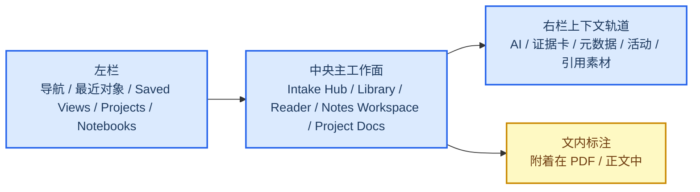
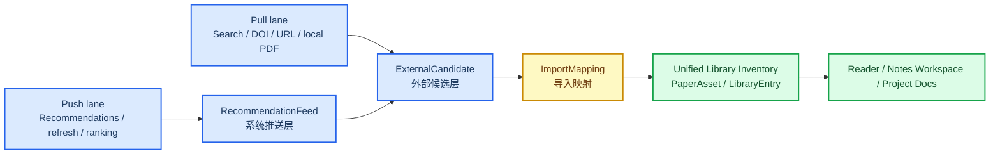
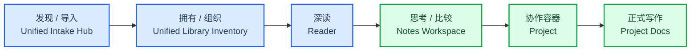

# 稷下：Research Workbench Reset 设计稿

**Goal:** 将当前仍然偏 demo / page-by-page 的 Web beta，重构为一个真正可承载研究工作的全屏研究工作台：外部发现、统一研究库存、单篇深读、跨论文思考、项目协作和多文档写作都在同一套空间语义中完成。

> **状态说明（2026-03-24）:** `demo-native-showcase` 已经按风险优先顺序落地了 ownership/contracts/intake/import/notebook-project boundary/project-owned docs/canonical `/projects/...` routes/three-pane shell/Reader-Notes Workspace-Project Docs 分离，以及浏览器侧 `Insert into project docs` 投影流程。更完整的 push-lane recommendation 仍然属于后续波次，而不是本稿声称已完成的内容。

## 🧭 设计结论

这次工作不是继续给现有 `Search / Library / Reader / Writer` 补功能，而是一次整体性的 **Research Workbench Reset**。本稿冻结以下已确认决策：

| 设计问题 | 已确认选择 | 含义 |
|---|---|---|
| 发现域边界 | Discovery & Intake bounded context | Pull / Push 都先落在外部候选层，再通过导入映射进入统一库存 |
| 发现/导入模型 | 统一 Intake Hub | Search 不再只是一个外部数据库页面，而是统一的研究 intake workbench |
| 发现工作流 | Pull lane + Push lane | `搜索` = 用户主动拉取；`今日推荐` = 系统主动推送；两者属于同一 discovery 域但不共享完成口径 |
| 一期目标源集合 | OpenAlex / PubMed / bioRxiv / arXiv / DOI / URL / local PDF | 计划按完全体定义目标，再在实现中分波落地 |
| Search 呈现方式 | 统一检索框 + 分源结果板 | 一个 query 入口，中央结果区按来源分板展示 |
| Library 前台真相 | 统一库存 + 多视图 | 用户看到一个研究库存；Personal / Project / Tag / Status / Saved View 是不同视图 |
| 总体空间模型 | 三栏研究驾驶舱 | 左侧稳定导航与对象入口，中间主工作面，右侧上下文轨道 |
| Reader 角色 | 单篇深读工作面 | Reader 负责单篇 paper 的深读与标注，不再承担全部 AI/笔记/综合写作工作 |
| 跨论文思考中心 | 独立 Notes Workspace | AI、比较、摘录、笔记、证据整理的主场不再被关进 Reader |
| Notebook / Project 边界 | Notebook 完全私有，Project 稳定协作 | Notebook 围绕研究问题组织；Project 围绕共享目标与正式产出组织 |
| Notebook → Project 连接 | 引用 / 插入助手 | 不共享 notebook 本体，只允许将私有思考重组为项目文档中的引用与素材 |
| Project Docs 形态 | 文档树 + 当前文档 + 引用侧栏 | Writer 不再是单文档 textarea，而是项目内共享文档工作区 |
| 所有权边界 | Discovery 候选、Notebook、Project Docs 各自独立所有 | 后续实现不得跨域直接读取 raw candidate 或私有 notebook 本体 |
| 共享写作所有权 | Project Docs / ProjectReference 都属于 project | 共享写作从 project docs 开始，不从 notebook 开始 |
| 协作强度 | presence，有协同感；无实时共编 | v1 不引入实时 CRDT 协同 |
| v1 研究对象集 | 文内标注 + Notebook 笔记 + 证据卡 | 不在 v1 引入独立 argument card，避免对象膨胀 |
| 当前诚实里程碑 | 统一摄取与深读工作台 | 这一波完成 Pull lane + Inventory + Deep Reading + Notes + Project Docs；Push recommendation 先冻结边界，不假装已完整落地 |

本稿在方向上吸收四类输入：

- 当前 Jixia 分支的真实问题：Search 结果稀薄、Library 只是堆栈、Reader 是表单堆、Writer 没有工作区导航
- `ResearchClaw` 的空间启发：全屏工作台、稳定壳层、Notes 作为独立工作面、Reader 的多模式深读
- 外部学术搜索与协作文档参考：学术搜索需要分页、rich metadata 和 direct-ingest；文稿工作区应与编辑器实现解耦
- 用户额外冻结的产品边界：Notebook 永远私有，Project Docs 才是共享写作场所

## 🧱 问题不是视觉问题，而是工作结构没有成立

当前 Web beta 的主要问题不是“样式不好看”，而是以下五层结构都还没有成立：

1. **discovery 边界不清**：外部候选、已导入库存、今日推荐、搜索结果都还混在一起
2. **intake 边界不清**：Search 还不是统一发现/导入入口
3. **库存边界不清**：Library 还不是一套可筛选、可组织、可回流的研究库存
4. **思考边界不清**：Reader、notes、AI、writer 的角色混在一起，导致每个面都很弱
5. **协作边界不清**：private notebook 与 shared project 之间缺少明确边界与桥梁

因此，这次 reset 必须同时重做：

- Discovery / Recommendation 边界
- 对象模型
- 空间模型
- 发现 / 拥有 / 阅读 / 思考 / 写作 主链
- private 与 shared 的边界

## 🏗️ 总体空间模型：三栏研究驾驶舱

Jixia 的下一代 Web 端不再以“打开一个页面做一个动作”为中心，而是以**同一块全屏研究台上的多工作面切换**为中心。

### 空间规则

#### 左栏：定位、切换、重入

左栏始终存在，不因进入 paper、notebook、project doc 而消失。它承载三类内容：

1. 顶层入口：`今日推荐 / 搜索 / Library / Projects / 设置`
2. 当前上下文：`Personal` 或 `Project / 项目名`
3. 对象入口：最近 paper、最近 notebook、saved views、项目文档、常用项目

`Notes Workspace` 可以是左栏中的一级工作入口，也可以是最近 notebook / 当前问题入口的强化表现，但它必须成为**真正可重返的独立工作面**，而不是 Reader 的附属抽屉。

#### 中央：唯一主工作面

中央区域永远只承载当前最重要的工作对象，但它支持不同密度与不同工作逻辑：

- Intake Hub：统一检索框 + 分源结果板 + direct-ingest 动作
- Library：分组、筛选、saved views、personal/project 视图
- Reader：单篇深读、全文/抽取文本/PDF/标注/元数据
- Notes Workspace：围绕研究问题的跨论文思考中心
- Project Docs：文档树 + 当前文档 + 引用/证据侧栏

#### 右栏：上下文轨道

右栏不再复制一个“第二页面”，而是承载围绕当前对象的辅助上下文：

- AI 对话
- 证据卡
- 元数据
- 活动与操作历史
- 可插入的引用素材

在 Reader 里，右栏更偏 paper context；在 Notes Workspace 里，右栏更偏 evidence / quote / AI helper；在 Project Docs 里，右栏更偏引用、证据、presence 和协作提示。

#### 评论：隐藏到阅读行为里

评论不再是右侧一个显眼大表单，而是附着在内容选择上的 annotation 行为：

- 选中文本 / PDF 区域
- 创建 private / project scope annotation
- 通过标注点、抽屉或侧边索引回看

这使得评论真正属于“阅读动作”，而不是页面上并排的第三个输入框。

## 🌐 Discovery & Intake：Push / Pull 双通道

Jixia 现在必须把「发现」从 Search 页面升级为一个正式有界上下文：**Discovery & Intake**。这个域负责两件不同但相邻的事：

- **Pull lane**：用户主动搜索、筛选、预览、导入
- **Push lane**：系统主动刷新、排序、解释、推送候选

这两条通道都属于 discovery 域，但都**不直接等于统一库存**。

### Discovery 的冻结规则

1. `搜索` 是 **Pull lane** 的主入口，目标是把外部候选带进研究台。
2. `今日推荐` 属于同一 discovery 域，但代表 **Push lane**，即系统主动组织出来的候选或 feed。
3. `ExternalCandidate`、`RecommendationItem`、`RecommendationFeed` 都不是 inventory 本体。
4. 只有通过 `ImportMapping` 进入 `PaperAsset / LibraryEntry` 的对象，才算进入统一库存。
5. Reader / Notes Workspace / Project Docs 只消费**已导入库存**，不直接消费 raw external candidate。
6. recommendation refresh / ranking / explanation / retry / audit 属于服务端 governed jobs 的责任，不是前端排序技巧。
7. recommendation signals（如 seen / saved / dismissed / imported）默认属于个人 discovery 域，不能默认泄漏到 project 边界。

### Discovery 的最小对象边界

| 对象 | 所属域 | 含义 | 是否已经进入库存 |
|---|---|---|---|
| `ExternalCandidate` | Discovery & Intake | 外部源标准化候选文献 | 否 |
| `RecommendationItem` | Discovery & Intake | 带解释与状态的推荐条目 | 否 |
| `RecommendationFeed` | Discovery & Intake | 系统主动推送的推荐集合 | 否 |
| `InterestProfile` | Discovery & Intake | 个人兴趣规则、关键词组、订阅偏好 | 否 |
| `CandidateState` | Discovery & Intake | `new / seen / saved / dismissed / imported` 等候选状态 | 否 |
| `ImportMapping` | Discovery & Intake → Inventory | 候选如何映射到 `PaperAsset / LibraryEntry` | 过渡对象 |
| `PaperAsset / LibraryEntry` | Inventory | 已拥有、可被阅读与引用的研究对象 | 是 |

这个对象层是 Jixia 吸收 OnTarget 能力时最关键的新边界：OnTarget 强在 push-style discovery，但 Jixia 必须把它吸收到一个受 server-first 治理的 discovery 域，而不是直接把推荐逻辑糊到 Library 或 Reader 上。

## 🔎 Intake Hub：统一发现与导入边界

Jixia v1 的发现入口不再被拆成许多互不相干的小工具，而是一个 **Unified Intake Hub**。它是 Discovery & Intake bounded context 在 **Pull lane** 下的主工作面。

### Intake Hub 的冻结规则

1. 一个统一查询框
2. 中央结果区按来源分板展示：OpenAlex / PubMed / bioRxiv / arXiv
3. DOI / URL / local PDF 作为 direct-ingest 侧动作，不强行塞进同一结果板语义
4. `今日推荐` 不是另一个架构，而是同一 discovery 域中的 Push lane 入口
5. Search 的目标不是停留在结果页，而是把对象带进研究台
6. 所有结果先是 external candidates，只有导入后才进入 inventory

### 为什么不是“很多独立搜索页”

如果把 OpenAlex、PubMed、arXiv、bioRxiv、DOI、URL、PDF 都拆成独立工具页，产品会很快退化成工具集合。统一 Intake Hub 的目标是维持一个稳定心智：

> 我不是在“切换数据库”，而是在把候选材料带进我的研究工作台。

### Intake Hub 与推荐域的关系

这次 reset 需要把两件事同时说清：

- **会完整实现的**：统一 Intake Hub 的 search / preview / import / direct ingest 能力
- **会冻结边界但不应假装完整实现的**：自动 recommendation 的刷新、排序、反馈闭环

也就是说，v1 的今天页可以存在、Push lane 的对象模型也必须被冻结，但不能因为页面有 `今日推荐` 就谎称 recommendation 域已经完成。

## 📚 Library：统一库存 + 多视图

Library 的前台真相必须从“导入堆栈”升级为**统一研究库存**。

### 前台语义

用户前台不再默认感知两套完全割裂的 personal library / project library，而是看到一套库存，然后通过不同视图理解它：

- Personal view
- Project view
- Tag / Category view
- Retrieval / Read / Evidence 状态视图
- Saved views

### 后台语义

后台仍然可以保留 server-first 的严格对象边界，例如：

- `PaperAsset`
- `LibraryEntry`
- visibility / ownership / sharing rules

但这些边界不应直接把用户前台劈成两块世界。

### Inventory 与 Discovery 的硬边界

统一库存的关键不是“显示更好看”，而是守住一条硬边界：

- external candidate 可以预览、保存、标记状态
- 但只有显式导入后，才会进入 unified inventory
- 只有 unified inventory 中的 paper，才能被深读、标注、生成证据卡、进入 quote / insert helper

### Library 的职责

Library 负责回答：

- 我现在已经拥有哪些研究材料？
- 哪些只拿到了 metadata？哪些有 PDF？哪些抽取了正文？
- 哪些已经阅读？哪些已经产生证据卡？
- 哪些属于某个研究问题？哪些与某个项目有关？

它不是结果页的“存档区”，而是研究工作的**拥有与组织中心**。

## 📖 Reader：单篇深读，而不是全部思考的中心

Reader 的职责被重新定义为：

> Reader 是单篇 paper 的深读工作面，不再承担跨论文综合思考、长期笔记组织和项目文稿编排的全部职责。

### Reader 的目标

- 展示真实的 paper 状态：metadata only / PDF available / text extracted / retrieval failed
- 支持单篇 paper 的阅读、标注、引用定位、元数据检查
- 支持把读到的内容转成可复用的私有笔记素材与证据卡

### Reader 的主要对象

- 文内标注
- 与当前 paper 强绑定的摘录
- 针对当前 paper 生成的证据卡

### Reader 明确不再承担的职责

- 不再是唯一 AI 工作面
- 不再是跨多篇 paper 的主思考空间
- 不再直接承担“把 latest insight summary 推进到 Writer”的模糊逻辑

Reader 可以保留布局模式，但这些模式服务的是单篇深读，例如：

- paper + metadata
- paper + AI helper
- paper + annotation index
- focus mode

## 📝 Notes Workspace：跨论文思考中心

这次 reset 的最大变化之一，是把 **Notes Workspace** 提升为独立工作面。

### Notes Workspace 的职责

它是研究者围绕某个**研究问题**进行私有探索的地方，可以同时容纳：

- 多篇 paper 的摘录
- AI 对话
- 私人笔记
- 对比表
- 证据卡整理
- 草稿片段

这里允许混乱、允许中间态、允许反复试错。

### Notebook 的组织原则

Notebook 以研究问题组织，而不是单篇 paper，也不是项目目录。

- 一个 notebook 对应一个研究问题或问题簇
- 一个 project 可以包含多个研究问题
- notebook 为个人探索服务，不等于项目文档

### Notebook 的权限边界

Notebook 在 v1 中是**完全私有**的：

- 不共享 notebook 本体
- 不把 notebook 镜像到 project
- 不让 project 直接吞掉 notebook

这个边界是本次设计冻结的关键，因为它比“半共享笔记”更清晰，也更容易让权限模型诚实成立。

## 🧠 研究对象模型

下一版 Jixia 需要把研究工作中产生的对象讲清楚。

| 对象 | 所在位置 | 作用 | 是否共享 |
|---|---|---|---|
| 搜索结果 | Intake Hub | 候选外部文献 | 否 |
| Library 条目 | Library | 已拥有的研究对象 | 取决于视图与权限 |
| 文内标注 | Reader 内容层 | 对正文/PDF 局部内容的私有或项目注解 | 可私有，也可 project scope |
| Notebook 笔记 | Notes Workspace | 围绕研究问题的私有探索性思考 | 否，永远私有 |
| 证据卡 | Reader / Notes Workspace / 右栏 | 结构化研究中间对象，可插入项目文档 | 可提升为项目使用 |
| Project 文档 | Project Docs | 团队共享、正式结构化输出 | 是 |

### `Insight summary` 的处理规则

当前的 `Insight summary` 既不像 AI 结果，也不像研究对象。v1 中它应被完全替换掉，而不是修饰命名。

替代方案只有一个：

- **证据卡** 作为可追溯、可插入、可引用的中间研究对象

v1 **不引入独立 argument card**，避免在对象层面过早复杂化。

## 🔐 State ownership / projection / shared writing ownership

在开始实现前，Jixia 还必须冻结一层更硬的执行规则：**谁拥有什么状态，什么对象可以跨边界，什么对象绝对不能跨边界。**

如果这一层不先钉死，后面的 Reader、Notes Workspace、Project Docs 在实现时就会各自发明语义，最后把 private / shared、candidate / inventory、note / document 再次搅混。

| 对象 | 真相域 | Owner | Project 是否可直接读到 | 能否直接进入 Project Docs | 规则 |
|---|---|---|---|---|---|
| `ExternalCandidate` / `RecommendationItem` | Discovery & Intake | 个人 discovery scope | 否 | 否 | 只能经 `ImportMapping` 进入 inventory |
| `PaperAsset / LibraryEntry` | Inventory | server-first inventory truth + visibility scope | 取决于可见性 | 是，但必须先成为 inventory | 深读、证据、引用都建立在 imported inventory 上 |
| `NotebookRecord / NotebookNoteRecord` | Notes Workspace | 单一用户 | 否 | 否 | notebook 永远私有，不共享、不镜像、不被 project route 反查 |
| `EvidenceCardRecord(scope=private)` | Notes / Reader | 单一用户 | 否 | 否，必须先投射 | 私有证据卡可作为投射源，但不是共享对象 |
| `EvidenceCardRecord(scope=project)` | Project | project | 是 | 是 | 这是项目内的共享证据对象 |
| `ProjectReference` / `ProjectDocumentReference` | Project Docs | project | 是 | 是 | 它是 project-owned projection，不是 notebook live view |
| `ProjectDocument*` | Project Docs | project | 是 | 是 | 共享写作从这里开始 |

### 冻结规则

1. **raw candidate 永远不是深读对象。** `ExternalCandidate`、`RecommendationItem`、`RecommendationFeed` 只能在 discovery 域里被预览、保存、标记状态，不能直接进入 Reader、Notes Workspace、Project Docs。
2. **Notebook 永远是 owner-private。** project 成员、project 页面、project 文档都不能直接解引用 notebook 本体。
3. **Notebook → Project 只能产生 project-owned projection。** `quote / insert helper` 复制的是被选中的片段、证据、摘要化素材与 paper provenance；共享文档不应依赖 notebook 实时存在。
4. **共享写作从 Project Docs 才真正开始。** notebook 不是“半共享草稿”，也不是 project doc 的隐式来源树。
5. **Evidence scope 必须显式。** evidence card 要么是 private，要么是 project-scoped；project docs 只能消费 project-scoped evidence 或 project-owned projection。
6. **共享文稿不能实时反查私有状态。** project 文档渲染、引用侧栏、presence 都只能基于 project-owned objects 工作，而不能因为某段内容源自 notebook 就回头读取 notebook body。

## 🧷 Imported inventory 是唯一深读入口

为了让 server-first truth 成立，Jixia 必须冻结一条会影响所有后续实现的规则：

> Reader、Notes Workspace、Project Docs 只消费已导入 inventory 中的 paper 与其派生对象，不直接消费 raw external candidates。

这条规则意味着：

- 外部候选可以在 Intake Hub 中被预览
- recommendation item 可以在 `今日推荐` 中被排序和解释
- 但 quote / insert helper、annotation、evidence card、project docs 写作都必须建立在已导入 paper 之上

这既是技术边界，也是产品诚实边界：Jixia 的真正研究工作不是直接建立在“搜索结果页”上，而是建立在“我已经拥有并纳入库存的研究对象”上。

## 🔗 Notebook → Project：引用 / 插入助手

因为 notebook 完全私有，所以 notebook 与 project 的关系不能是共享或镜像，只能是**重组与提炼**。

### 冻结规则

1. Notebook 永远不直接共享给 project
2. Project Docs 只能通过引用 / 插入助手获取 notebook 中的可复用内容
3. 被插入项目文档的是：引用片段、证据卡、摘要化片段，而不是 notebook 本体

### 为什么这样设计

这可以同时满足三件事：

- notebook 保持私密与自由
- project docs 保持清晰与稳定
- 写作时仍可复用私有思考成果，而不引入权限混乱

## 👥 Projects 与 Project Docs

Projects 被定义为**多用户、目标驱动、稳定协作**的空间。

### Project 的职责

- 共享 Library 视图
- 共享证据卡 / 标注索引
- Project Docs 文稿区
- 活动流与决策轨迹

### Project Docs 的冻结形态

Project Docs 不再是“从 Reader 跳进去的单篇 textarea”，而是一个真正的共享文稿工作区：

- 左：文档树
- 中：当前文档
- 右：引用 / 证据 / AI / presence 侧栏

### 协作强度

v1 的协作强度冻结为：

- 有 presence：能看到谁在线、谁最近动过、当前文档属于哪个共享上下文
- 无实时共编：不在 v1 引入 CRDT / 实时光标同步 / 实时冲突解决

这让产品先拿到“共同工作感”，而不被实时协同基础设施拖住。

## 🔄 主工作流

Jixia 的主工作流必须从“页面跳转链”收敛到一条研究主链：

这条链条不是 demo 导览，而是产品主心智：

**Intake → Inventory → Read → Think → Share → Write**

## 🏁 当前波次的诚实名字：统一摄取与深读工作台

虽然 reset 设计已经把 Discovery / Recommendation 的边界补齐，但当前这一波的**诚实完成口径**仍然应该是：

> **统一摄取与深读工作台（Unified Intake & Deep Reading Workbench）**

这意味着本波次必须真正完成的是：

- Pull lane 的统一 search / import / direct ingest
- unified inventory
- Reader 深读
- private Notes Workspace
- Project Docs 写作与 quote / insert helper

而本波次**不应偷带宣称完成**的是：

- 全自动 recommendation refresh 闭环
- 行为学习 / 自适应重排序
- project-level shared recommendation feeds
- 复杂 recommendation explanation / feedback loop

## 🧪 Honest beta 验收标准

新的 Web beta 不能再用旧的“页面存在即可”标准。并且本波次的验收标准必须与 `统一摄取与深读工作台` 这个名字保持一致，而不是把 recommendation 域的未来能力提前算进去。

当前 honest beta 至少应能跑通：

1. 在 Unified Intake Hub 里用统一检索框检索多源学术内容
2. 至少从一个外部源导入论文，同时支持 DOI / URL / local PDF 作为 direct-ingest 入口
3. 外部候选通过显式 import mapping 进入 unified inventory，而不是被直接当成已拥有条目
4. 在 Library 中通过 tag / category / status / saved view 管理统一库存
5. 在 Reader 中看到 paper 的真实 retrieval 状态并创建 annotation
6. 在 Notes Workspace 中围绕研究问题组织跨论文 private notes
7. 生成证据卡
8. 在 Project Docs 中通过引用 / 插入助手把私有研究素材转成共享文稿内容
9. 重启应用后诚实确认哪些状态被设计为持久化，哪些尚未持久化

如果 `今日推荐` surface 存在，它必须被清楚表述为 discovery 域中的 Push lane 入口；它的存在本身**不能**被拿来宣称自动 recommendation 已经完整落地。

只有这条链完整成立，Jixia 才能诚实地称为“研究工作台 beta”。

## 🚫 明确拒绝的方向

为避免实现过程中回退，本设计明确拒绝：

1. 把 Search 继续维持为少量标题卡片
2. 把 Intake 拆成互相无关的多个搜索页
3. 把 Library 继续维持为平铺导入列表或默认双裂 personal/project 视图
4. 把 Reader 保持为 `note/comment/insight` 三个大表单
5. 继续把 AI / 比较 / 长期笔记关在单篇 Reader 里
6. 让 raw external candidates 直接进入 Reader / Notes Workspace / Project Docs
7. 把 `今日推荐` 页面存在当成 recommendation 域已完成
8. 默认把 recommendation signals 泄漏给 project 或 shared context
9. 共享或镜像整个 private notebook 到 project
10. 让 Writer 继续是单篇 textarea + publish 按钮
11. 在 v1 引入独立 argument card
12. 在 v1 直接引入实时共编
13. 继续使用窄栏 `page-shell` 作为桌面端主要空间组织

## ❓后续实现需要冻结但不改变大方向的问题

1. 完全体 Intake Hub 的内部落地顺序：OpenAlex、PubMed、bioRxiv、arXiv、DOI、URL、local PDF 的先后波次
2. Push lane 何时从“边界已冻结”升级为“真正开始实现 recommendation refresh / ranking”
3. `InterestProfile` 的最小粒度：关键词组、订阅主题、收藏行为，还是显式规则组合
4. `CandidateState` 的默认隐私粒度，以及是否允许项目级 recommendation signal 出现
5. `今日推荐` 在导航中是独立入口还是 Intake Hub 的一个系统模式层
6. `Notes Workspace` 是否在左栏拥有一级入口，还是以 notebook / question entry 形式进入
7. PDF / extracted text 的获取策略与失败状态呈现
8. 证据卡 schema 与 evidence span 的演进策略
9. Project Docs 的编辑器选型：BlockNote、Tiptap 自定义 schema，或两阶段组合
10. presence 需要呈现到什么粒度：项目级、文档级、段落级

## ✅ 当前结论

Jixia 下一阶段应被定义为一次 **Research Workbench Reset**：在结构上补上 **Discovery & Intake bounded context**，明确区分 Pull 与 Push；以前者完成 **Unified Intake Hub**、**Unified Library Inventory**、**Reader**、**Notes Workspace**、**Project Docs** 这条主工作链，以 **quote / insert helper** 作为 notebook 与项目文稿之间唯一合法桥梁，并以 **imported inventory only** 作为深读、证据与写作的硬边界。当前设计的正确目标不是“把现有 web beta 做顺一点”，而是先诚实完成一版 **统一摄取与深读工作台**，再在后续波次里把 recommendation 域真正做实。
