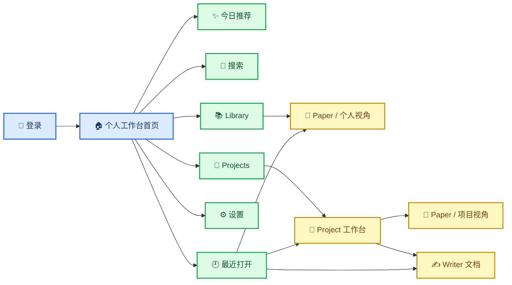
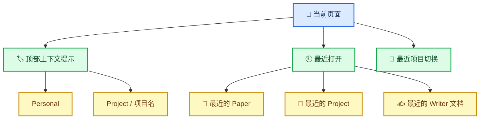

# 稷下：Web 交互架构与工作台设计稿

**Goal:** 将当前 `Spaces -> Library -> Reader -> Writing` 的线性演示流，重构为一个**个人优先、项目协作增强、`space` 对用户基本无感**的研究工作台。

## 🧭 产品定义

`Jixia` 的 Web 端不应继续围绕“先选一个 space，再进入某条固定路径”来组织。用户真正需要的不是容器选择器，而是一个**先做事**的研究工作台：登录后直接进入个人工作台首页，通过稳定导航进入推荐、搜索、文献库、项目协作和设置。

这一定义冻结以下决策：

| 决策 | 已确认选择 | 含义 |
|---|---|---|
| 默认入口 | 个人工作台首页 | 登录后先看到总览，而不是推荐单页、Library 单页或 space 选择器 |
| 顶层导航 | `今日推荐 / 搜索 / Library / Projects / 设置` | 用户按任务理解产品，不按底层容器理解产品 |
| 协作入口 | `Projects` | 共享内容主要通过项目进入，而不是通过显式 shared space 进入 |
| 空间模型 | `space` 保留在底层 | `space` 继续承担权限与数据归属，但不作为用户主导航概念 |
| 页面切换 | 快速来回切换 | 依靠“最近打开”和上下文提示切换，不做全局标签页地狱 |

本稿吸收三个来源的经验：

- 当前 Jixia shell 暴露出“线性 demo 流”的局限
- `ResearchClaw` 提供“稳定导航 + 工作台感 + 局部上下文”的参考
- `OnTarget` 提供“今日推荐 / 外部检索 / 导入 / 去重 / 已读状态”的能力方向

## 🏠 登录后入口与整体骨架

用户登录成功后，第一眼应进入**个人工作台首页**。这个首页不是单一功能页，而是一个总览页，用来帮助用户快速回到当天最重要的研究上下文。

首页应包含至少四类信息：

1. 今日推荐的重点内容
2. 最近阅读的文献
3. 最近进入的项目
4. 最近编辑的文档

Web 壳层必须提供一个**始终存在的稳定导航**。导航不因用户进入 paper、project 或 writer 而消失。页面顶部只保留轻量上下文提示，用来告诉用户当前是在个人视角，还是在某个项目视角。

### 当前页面感知

页面顶部的轻量上下文提示建议只表达用户真正关心的信息：

- `Personal`
- `Project / 项目名`

它的作用不是让用户操作底层容器，而是帮助用户随时确认“我现在看的内容属于我自己，还是属于某个共享项目”。

## 🗂️ 五个主入口的职责

五个主入口必须各司其职，避免入口之间职责混叠。

| 入口 | 用户心智 | 主要职责 | 不应该承担的职责 |
|---|---|---|---|
| `今日推荐` | 系统主动告诉我今天该看什么 | 推荐值得关注的论文、延续昨日未完成阅读、解释推荐原因 | 不做外部主动检索结果页 |
| `搜索` | 我要去外部世界找资料 | 搜外部文献源、预览结果、导入进入 Jixia | 不承载本地库存整理 |
| `Library` | 我的研究库存 | 管理个人已导入文献、分类、标签、本地搜索、阅读状态 | 不替代项目协作页 |
| `Projects` | 我和别人一起推进的工作 | 项目概览、共享 Library、Writer、活动记录 | 不承载个人默认入口 |
| `设置` | 把系统调成适合我 | API key、账号信息、兴趣偏好、以后扩展模型与通知 | 不承载日常内容工作 |

### 主线流程

Jixia 的主线不应是“搜到东西就直接扔进共享项目”，而应是：

> **推荐发现 / 搜索发现 → 收进个人 Library → 阅读与分析 → 有协作价值时再加入 Project → 成熟内容进入 Writer**

这个顺序符合真实研究习惯，也天然支持“私人默认、共享按需进入”。

## 📄 Paper 工作台

Paper 页面是 Jixia 的核心工作面。它不只是阅读器，而是围绕单篇文献展开的研究工作台。

### 基本结构

- 左半边：论文本体（PDF / HTML）
- 右半边：围绕该 paper 的工作面板

右半边不应该混成一个聊天框，而应拆成清晰入口：

| 面板 | 职责 |
|---|---|
| `AI 对话` | 用户围绕该 paper 与 AI 做私人推理、提问、整理思路 |
| `私人笔记` | 用户自己的理解、摘录、待确认想法 |
| `共享评论` | 项目成员可见的协作讨论 |
| `关键信息` | 摘要、作者、标签、导入来源、关联项目等元信息 |

### 默认隐私原则

**AI 对话默认私人。** 共享出去的应该是整理后的评论、项目可见笔记、或进入 Writer 的成熟内容，而不是整个原始 AI 聊天记录。

这样做的原因是：

1. 原始 AI 对话通常噪音大
2. 用户需要安全的私人推理空间
3. 项目共享区应保存更成熟、可复用的内容

### 同一篇 paper 的两种视角

#### 从个人 Library 打开

页面顶部显示 `Personal`。默认强调：

- 私人 AI 对话
- 私人笔记
- 个人标签与整理

同时允许用户显式执行：

- `加入某个 Project`
- `在某个 Project 中打开共享视角`

#### 从某个 Project 打开

页面顶部显示 `Project / 项目名`。除了个人内容，还能看到：

- 项目共享评论
- 项目共享笔记
- 与该项目相关的 Project Docs 文档入口

用户感知到的是“同一篇 paper 的不同工作视角”，而不是“进入了另一套系统”。

## 🤝 Projects 与 Project Docs 的角色分工

`Projects` 页面不能只是共享文献列表，而应是一个小型共享工作台。进入某个项目后，至少应包含四块内容：

1. 项目概览
2. 共享 Library
3. Project Docs 共享知识中心
4. 活动 / 讨论记录

### Project 的定位

Project 是用户进入共享协作的主要入口。它代表一个具体研究任务，而不是抽象共享容器。

示例：

- 肿瘤标志物项目
- 文献综述项目
- 课题申请书项目

### Project Docs 的定位

Project Docs 不是 paper 右侧笔记区的放大版，而是**项目共享知识中心与正式产出区**。它应该承载：

- 会议纪要
- 文献综述草稿
- 研究计划
- 项目总结
- 课题材料

项目页上的 `Project Docs 共享知识中心` 应先通过服务端 workspace DTO
发现当前项目最新可见的共享文稿，再决定是直接重开已有 Project Doc 草稿，还是显示
“尚未创建 Project Doc”的空状态提示。
进入 `/projects/:projectId/writing/:docId` 之后，页面应继续通过
`GET /api/project-docs/:documentId` 读取当前最新快照；如果文稿已经存在但还没有保存过任何版本，
服务端也应返回 `content = ''`、`citations = []`、`versionNumber = 0` 的真实空快照，而不是让前端补假数据。

因此三者必须分工明确：

| 位置 | 角色 |
|---|---|
| paper 私人笔记 | 个人理解与草稿思考 |
| paper 共享评论 | 围绕某篇 paper 的项目讨论 |
| Project Docs 文档 | 已经上升成项目共享知识与正式内容的输出 |

## 🔁 快速切换与上下文感知

Jixia 的切换感应来自“系统记住最近上下文”，而不是“让用户手工维护一排标签页”。

### 切换机制

应至少提供以下四种轻量切换能力：

1. **最近打开**：记住最近看的 paper、进入的 project、编辑的文档
2. **顶部上下文提示**：始终告诉用户当前是 `Personal` 还是 `Project / XXX`
3. **当前项目快速切换**：在项目视角下，允许快速切到最近项目
4. **对象级回跳**：用户可以从项目文档快速回到刚才看的 paper，反之亦然

### 明确拒绝的切换模型

本设计明确不建议：

1. 顶部堆满全局标签页的浏览器式交互
2. 每进入一个对象就进入完全不同的页面体系
3. 用户必须先选 `space` 才能继续操作

用户切换的应该是“当前工作视角”和“当前对象”，而不是切换到另一个应用。

## 🫥 Space 的隐身策略

`space` 仍然应该存在，但主要存在于底层权限、数据归属和治理逻辑中，不应成为用户必须反复理解的产品概念。

### 用户实际感知到的概念

| 用户看到的词 | 底层真实语义 |
|---|---|
| `Personal` | 用户的个人 space |
| `Project / XXX` | 某个共享 project 所在的共享协作边界 |
| `共享评论` | project 作用域内可见内容 |
| `个人笔记` | 个人作用域内可见内容 |

因此，Jixia 前台不需要突出“space picker”，而是应通过以下方式让边界自然可见：

- `Personal` / `Project / 项目名` 的顶部提示
- 个人与共享内容的可见性徽标
- 从个人库加入 project 的显式动作

## 🚫 明确拒绝的交互模型

为避免后续实现时范围漂移，本设计稿明确拒绝以下方向：

1. 登录后先进入 `space` 选择器
2. 让 `Projects` 退化成普通文件夹列表
3. 将 AI 原始对话默认共享给项目成员
4. 将个人 Library 与项目共享 Library 无提示混在一起
5. 用全局标签页取代上下文提示与最近打开机制

## ❓仍需后续冻结的实现问题

以下问题不会改变本稿的大方向，但会影响实现顺序与技术选型：

1. 登录形态一期采用何种账号系统
2. 今日推荐的一期优先级：偏个人兴趣、偏项目推进、还是混合排序
3. Writer 的可视编辑体验仍需冻结：当前服务器/公共传输层已有 Jixia 自有
   `documentContent` 结构化文档底座并继续返回 legacy `content` 文本投影，
   但前台编辑器是 Markdown first、block-based，还是混合结构，仍需后续设计决定。
4. 外部搜索一期优先接哪些来源：PubMed、arXiv、DOI、URL、PDF
5. 最近打开列表的容量、排序规则与跨设备同步策略

## ✅ 当前结论

Jixia 的下一阶段 Web 设计已经不应继续围绕 `Spaces -> Library -> Reader -> Writing` 的线性演示流推进，而应收敛为：**个人工作台首页 + 稳定任务导航 + Personal / Project 双视角 + paper 工作台 + project 协作工作台 + Writer 正式产出区**。`space` 保留在底层权限模型，前台主心智则收敛为“我的研究工作台”与“我参与的项目”。
