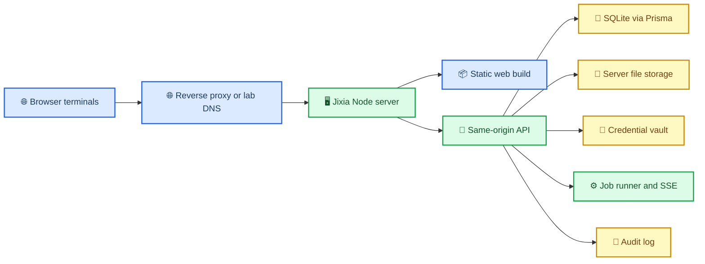
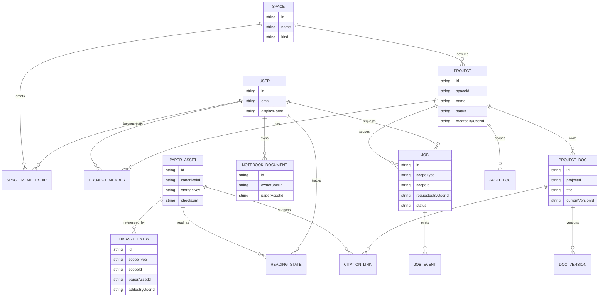

# Jixia Project-first Recovery Plan

_Purpose: establish the recovery plan for turning the current Jixia scaffold into a lab-hosted, server-first, project-centered research collaboration system._

---

## 🧭 Executive decision

Jixia should continue as a **lab-hosted server-first web platform**. The backend runs on a controlled server, while researchers use browsers or other thin clients from separate terminals. The server owns all authoritative state: identity, projects, permissions, literature assets, reading state, private notes, shared project documents, AI jobs, files, credentials, and audit records.

The current implementation should not be expanded as a Space-first product shell. It should be recovered around one architectural sentence:

> **Space is governance. Project is collaboration.**

This plan makes `docs/plans/design.md` the target-state product baseline and narrows the near-term implementation to a real project-centered research loop. Older Space-first platform plans remain useful as historical server-first scaffolding notes, but they should no longer define the foreground product model.

## 🧱 Current diagnosis

The project failed because the product semantics and data model diverged. The design baseline says `Project` is the primary research collaboration unit, but the current contracts, Prisma schema, server state, API, and UI are still centered on `Space`. The route layer contains project-like paths, yet `Project` is not a first-class domain entity.

| Area | Current state | Recovery decision |
| --- | --- | --- |
| Foreground work unit | `Space` navigation and synthetic project route params | Make `Project` first-class and move `Space` to governance/settings |
| Persistence | `server-state.json` is the effective runtime truth | Move authoritative state to Prisma/SQLite for MVP |
| Identity | API requests can carry actor fields from the client | Server derives actor from login/session |
| Personal vs shared | Visibility strings mix private, shared, and project semantics | Use explicit personal/project scopes and separate document types |
| Research documents | `WritingDoc` is too broad | Split private `NotebookDocument` and shared `ProjectDoc` |
| UI reliability | Demo fallback data can mask server failures | UI must call real APIs; demo mode must be explicit |
| AI governance | Job/audit scaffolding exists but scope is weak | Jobs must be scoped, audited, and server-owned |

The frontend should not be treated as the root failure. The frontend failed because it was asked to present entities that the server did not actually own.

## 🏛️ Target runtime shape

The first production-shaped runtime is a same-origin web app served by the Jixia server. Browser clients are thin terminals. The backend holds the database, file storage, credential references, job runner, and audit log.



MVP deployment should prefer:

- Node server serving the Vite-built frontend and `/api/*` routes from the same origin.
- Prisma with SQLite as the authoritative early database.
- Server-side file storage under `JIXIA_STORAGE_ROOT`.
- Server-derived sessions instead of client-supplied actor IDs.
- Server-sent events for job status updates.

MVP should avoid Electron/Tauri, offline-first local sync, split frontend/API origins, custom realtime collaboration, Kubernetes, and public SaaS assumptions.

## 🧩 Domain model decision

The recovery model should make the ownership and visibility of every research object obvious from the data structure.



Core rules:

- `Space` is a governance container for lab/team membership, policy, storage, credentials, and audit grouping.
- `Project` is the formal shared research collaboration unit.
- `ProjectMember` is required; `SpaceMembership` must not substitute for project access control.
- `PaperAsset` is the deduplicated source asset and does not express ownership.
- `LibraryEntry` expresses that a user or project has adopted a `PaperAsset` into its scoped library.
- `NotebookDocument` is private by default and belongs to one user.
- `ProjectDoc` is shared, project-scoped, versioned, and citable.
- `Job` is a server-owned action with explicit scope, status, events, credential references, and audit records.
- `ReadingState` is per user; project members do not overwrite each other's reading progress.

Use an explicit scope reference for objects that may belong either to a user or project:

```ts
type ScopeRef =
  | { type: "user"; id: string }
  | { type: "project"; id: string };
```

Do not use route parameters, frontend state, or visibility strings as the source of truth for ownership.

## 🔁 Minimal recovery loop

The first working artifact should prove the full research loop through real server data.

```mermaid
flowchart LR
    accTitle: Minimal Research Loop
    accDescr: The recovery MVP validates project creation, scoped literature import, reading, private synthesis, shared project writing, versioning, and governed AI jobs.

    login["🔐 Login"] --> project["📁 Create project"]
    project --> import["📚 Import paper"]
    import --> reader["📖 Read and excerpt"]
    reader --> notebook["🔒 Private notebook"]
    notebook --> project_doc["📝 Project doc"]
    project_doc --> version["📌 Save version"]
    version --> job["⚙️ Scoped AI job"]
    job --> audit["🧾 Audit trail"]

    classDef identity fill:#dbeafe,stroke:#2563eb,stroke-width:2px,color:#1e3a5f
    classDef research fill:#dcfce7,stroke:#16a34a,stroke-width:2px,color:#14532d
    classDef governance fill:#fef9c3,stroke:#ca8a04,stroke-width:2px,color:#713f12

    class login identity
    class project,import,reader,notebook,project_doc,version research
    class job,audit governance
```



Acceptance path:

1. Alice logs in from browser terminal A.
2. Alice creates a project on the server.
3. Alice imports or uploads a paper; the server creates or reuses `PaperAsset` and creates a project-scoped `LibraryEntry`.
4. Alice opens the reader; reading state is stored for Alice, not for the project as a whole.
5. Alice writes a private `NotebookDocument`; project members cannot read it.
6. Alice creates a `ProjectDoc` and cites the paper or excerpt.
7. Bob, a project member, can read the `ProjectDoc`.
8. Charlie, not a project member, cannot read the `ProjectDoc`, project library entry, file, job, or audit trail.
9. Alice starts a project-scoped AI job; the server records `Job`, `JobEvent`, and `AuditLog` rows.
10. A second browser terminal sees the same project state from the server after refresh.

## 🗺️ Implementation phases

### Phase 0: Architecture and operator boundary

Goal: make the recovery direction explicit before more code is added.

Tasks:

- Mark `docs/plans/design.md` as the current target product baseline.
- Mark or update older Space-first plans so they cannot be mistaken for the active foreground model.
- Update README/operator docs to state that Jixia runs as a lab-hosted server and browser clients are thin terminals.
- Preserve the server-first deployment contract from Task 11 while clarifying that Task 11 did not settle the domain model.

Acceptance criteria:

- Documentation states `Space is governance; Project is collaboration`.
- Documentation states that the server owns authoritative state and clients do not store authoritative research data.
- No active plan describes `Space` as the foreground research work unit without explaining its governance-only role.

### Phase 1: Identity and session boundary

Goal: stop trusting client-supplied actor fields.

Tasks:

- Use the `User` table in runtime code.
- Add login/session support suitable for lab-hosted MVP use.
- Add a server helper such as `getActor(request)`.
- Remove mutation paths that trust `actorUserId` or `actorSpaceId` from request bodies.
- Add dev seed users for local verification.

Acceptance criteria:

- Browser users must log in before accessing project data.
- The server derives the actor from a session or equivalent server-controlled mechanism.
- A request body cannot impersonate another user.

### Phase 2: Project-first schema and contracts

Goal: make project collaboration a first-class server concept.

Tasks:

- Add shared contracts for `Project`, `ProjectMember`, and `ScopeRef`.
- Add Prisma models for `Project` and `ProjectMember`.
- Refactor `LibraryEntry`, `Job`, and audit-facing contracts to include explicit scope.
- Add `NotebookDocument` and `ProjectDoc` contracts and schema models.
- Keep `PaperAsset` as global/deduplicated.

Acceptance criteria:

- `Project` exists in shared contracts, schema, repository code, API responses, and UI data.
- `ProjectMember(projectId, userId)` is the basis for project access checks.
- `LibraryEntry` can represent personal and project libraries without changing `PaperAsset` ownership.
- Private notebook documents cannot be represented as project documents by flipping a visibility flag.

### Phase 3: Prisma-backed authoritative persistence

Goal: replace the JSON blob as the authority for collaborative data.

Tasks:

- Instantiate Prisma in the server runtime.
- Implement repositories for users, spaces, projects, library entries, assets, notebook documents, project documents, jobs, and audit logs.
- Keep JSON state only as a dev/demo migration aid if still needed.
- Add migrations and seed scripts.
- Document SQLite database location, backup expectations, and `JIXIA_DATABASE_URL` behavior.

Acceptance criteria:

- Restarting the server preserves users, projects, library entries, documents, jobs, and audit records.
- Repository tests verify key constraints and access patterns.
- Runtime code does not treat `server-state.json` as the collaborative source of truth.

### Phase 4: Server-owned files and literature assets

Goal: make uploaded and imported literature assets authoritative on the server.

Tasks:

- Add upload/import endpoints that write files under `JIXIA_STORAGE_ROOT`.
- Store only safe storage keys in the database; never expose raw server file paths to clients.
- Add checksum-based asset reuse.
- Add authorized download/stream endpoints.
- Tie access to personal/project `LibraryEntry` visibility through server checks.

Acceptance criteria:

- A browser can upload a PDF and another authorized terminal can read it through the server.
- A non-member cannot download project-scoped assets.
- File paths and provider credentials are not exposed in browser payloads.

### Phase 5: Project-first API and UI recovery

Goal: remove synthetic project state from the browser and drive screens from real server objects.

Tasks:

- Add project-first routes such as `/projects/:projectId/library`, `/projects/:projectId/reader/:assetId`, and `/projects/:projectId/docs/:docId`.
- Move `Space` management to settings/admin surfaces.
- Remove hardcoded `shared-space`, `tumor-board`, and similar route defaults from the app shell.
- Replace demo fallback data with explicit demo mode or real API error states.
- Build minimal Home, Projects, Project Library, Reader, Notebook, Project Docs, and Jobs/Activity screens.

Acceptance criteria:

- UI can complete the minimal recovery loop using real API calls.
- Missing server data appears as an error or empty state, not as silent fallback content.
- Browser terminal B can observe server state created by browser terminal A.

### Phase 6: Governed AI jobs

Goal: keep AI assistance embedded, scoped, and auditable.

Tasks:

- Scope every job to a user or project.
- Store provider access through credential references only.
- Emit `JobEvent` records and stream them with SSE.
- Require user confirmation before AI output becomes durable project knowledge.
- Link AI outputs to evidence/citations/context when possible.

Acceptance criteria:

- AI jobs cannot read private notebook content unless the actor explicitly includes it.
- Project-scoped AI jobs are visible only to authorized project members.
- AI output persistence creates audit records.

## 🚫 Deferred work

Do not implement these before the recovery loop passes:

- Full AI Workspace.
- Global Search or command palette.
- Realtime collaborative editing.
- Full citation formatting engine.
- Object-attached discussions.
- Arbitrary collection graphs.
- Complex ACL matrices beyond owner/editor/viewer.
- Multi-level projects or nested workspaces.
- Offline-first clients or local database sync.
- Public SaaS deployment, billing, or multi-tenant hosting beyond lab-controlled spaces.

## ✅ Verification gates

Every implementation phase must carry verification evidence.

| Gate | Required verification |
| --- | --- |
| Contracts | Typecheck and contract tests for browser-safe DTOs |
| Schema | Prisma migration/seed checks and repository tests |
| Access control | Personal invisible, project member visible, non-member denied |
| File access | Authorized upload/download and denied non-member download |
| UI loop | Browser smoke test against a running server |
| Jobs | SSE/job event test plus audit record assertion |
| Build | `npm run typecheck`, `npm test`, and `npm run build` before handoff |

The highest-level manual QA gate is a real browser or HTTP/API walkthrough of the minimal recovery loop, not a screenshot of static pages.

## 🧨 Explicit anti-patterns

These are blocked for the recovery effort:

- Renaming `Space` to `Project` instead of adding a real `Project` entity.
- Continuing to build project features while `projectId` exists only in URLs.
- Using `SpaceMembership` as a substitute for `ProjectMember`.
- Modeling private notes and shared docs as one nullable catch-all table without database constraints.
- Treating `visibility` strings as ownership.
- Trusting actor IDs sent from browser payloads.
- Letting frontend fallback data hide server failures.
- Serving raw storage paths or provider keys to the browser.
- Building Home, Global Search, or AI Workspace before the server-owned research loop exists.

## 🏁 First implementation slice

The next development slice should be deliberately small:

1. Add the active recovery plan and update documentation status markers.
2. Add shared `Project`, `ProjectMember`, and `ScopeRef` contracts.
3. Add Prisma `Project` and `ProjectMember` models and migration.
4. Add repository/service functions for creating projects and listing projects for an actor.
5. Add session-derived actor handling for the project API path.
6. Add tests for project membership access.
7. Replace synthetic project context in the web shell with server-loaded projects.

This slice does not need to solve the full library, reader, notebook, or AI job loop. It only needs to remove the fake project foundation. After that, project-scoped library entries and documents can be implemented without continuing the current semantic leakage.
